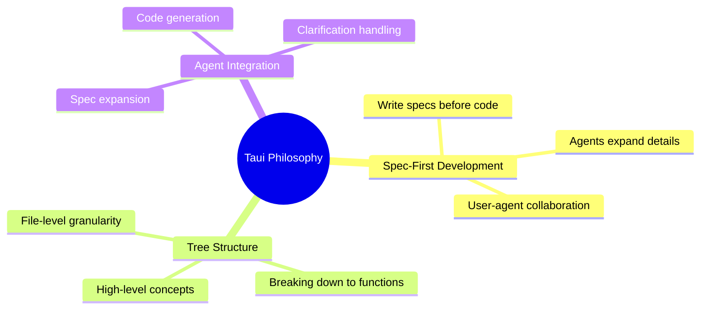
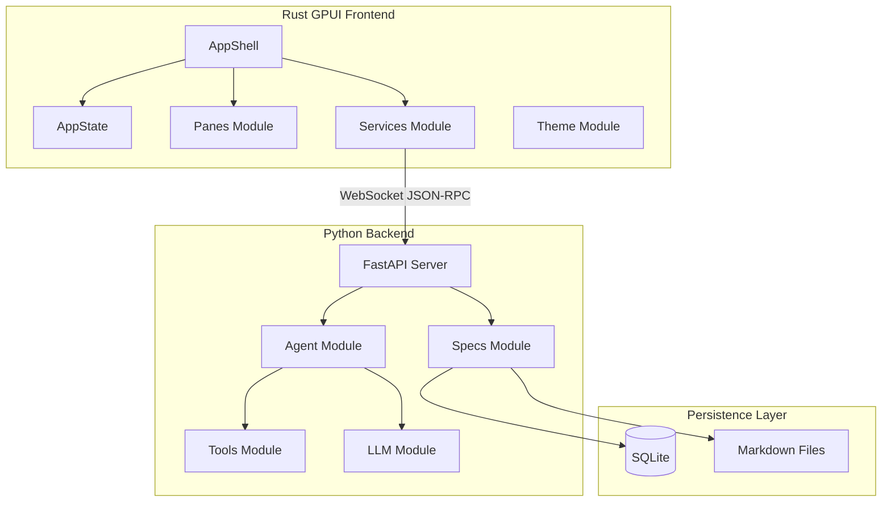

# Taui Architecture Notes
{{status: in-progress}}

Taui is an agentic coding interface that uses a spec-first development approach. Users collaborate with AI agents to write specifications, and Taui generates code based on those specs. The system consists of a Python backend and a Rust GPUI frontend communicating via WebSocket JSON-RPC.

## Overview
{{status: done}}

Taui follows a unique paradigm where specifications are first-class citizens. The spec tree structure starts with high-level project concepts and breaks down into smaller pieces down to the level of functions, classes, and files.

### Core Philosophy

### Technology Stack

| Layer | Technology | Purpose |
|-------|------------|---------|
| Backend | Python 3.13 + FastAPI | Spec management, agent orchestration |
| Frontend | Rust + GPUI | Native GPU-accelerated UI |
| Protocol | WebSocket + JSON-RPC 2.0 | IPC communication |
| Storage | SQLite (in-memory) | Spec persistence |
| LLM | Multiple providers | Agent intelligence |

## Architecture Layers
{{status: done}}

## Child Index

- [Backend Architecture](notes/backend.md#backend-architecture)
- [Frontend Architecture](notes/frontend.md#frontend-architecture)
- [IPC Protocol](notes/protocol.md#ipc-protocol)
- [Spec System](notes/spec_system.md#spec-system)
- [Agent System](notes/agent.md#agent-system)
- [Data Models](notes/data_models.md#data-models)
- [State Management](notes/state_management.md#state-management)
- [Theme System](notes/theme.md#theme-system)
