# Agent System
{{status: done}}

The agent system orchestrates AI-powered interactions with the spec tree, handling code generation, clarifications, and tool execution.

## Agent Architecture
{{status: done}}

### High-Level Overview

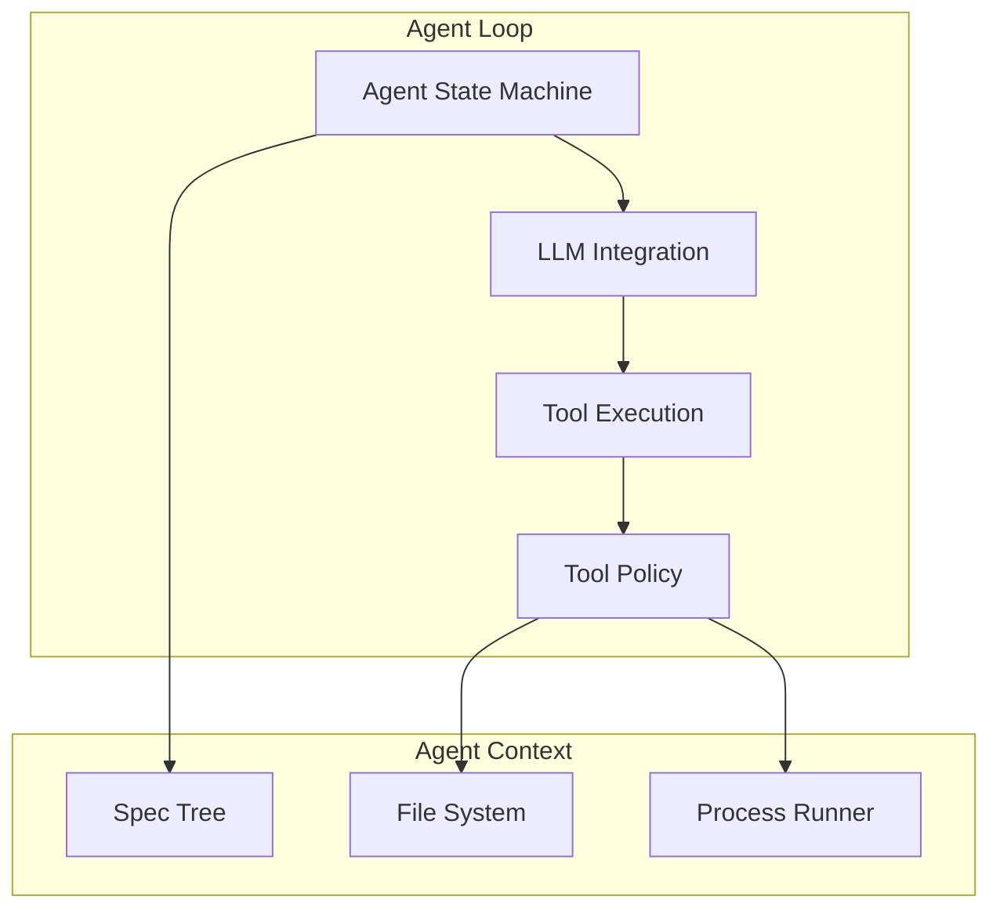
```mermaid
graph TB
    subgraph AgentLoop["Agent Loop"]
        AL[Agent State Machine]
        LLM[LLM Integration]
        TP[Tool Policy]
        TC[Tool Execution]
    end
    
    subgraph Context["Agent Context"]
        SPEC[Spec Tree]
        FILES[File System]
        PROC[Process Runner]
    end
    
    AL --> LLM
    LLM --> TC
    TC --> TP
    TP --> FILES
    TP --> PROC
    AL --> SPEC
```

### Directory Structure

```
taui/agent/
├── loop.py          # Main agent loop
├── state.py         # Agent state machine
└── tool_policy.py   # Tool execution policies

taui/tools/
├── base.py          # Tool interface
├── fs.py            # File system tools
└── ...              # Other tool implementations

taui/llm/
├── base.py          # LLM interface
└── ...

taui/llms/
├── anthropic.py     # Anthropic Claude
├── openai.py        # OpenAI GPT
├── ollama.py        # Ollama local
└── ...              # Other providers
```

## Agent State Machine
{{status: done}}

### State Transitions

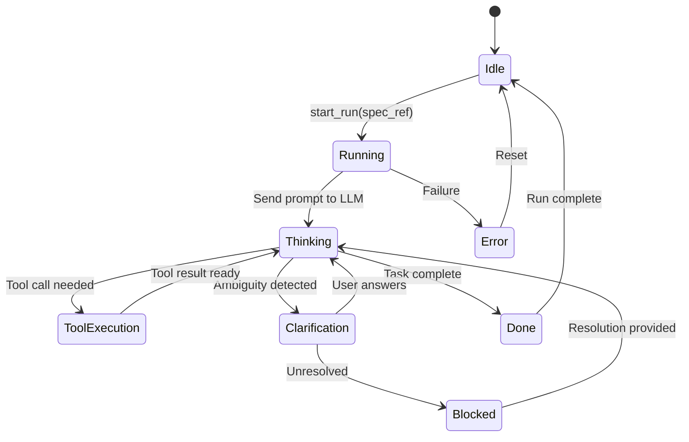
```mermaid
stateDiagram-v2
    [*] --> Idle
    Idle --> Running: start_run(spec_ref)
    Running --> Thinking: Send prompt to LLM
    Thinking --> ToolExecution: Tool call needed
    Thinking --> Clarification: Ambiguity detected
    Thinking --> Done: Task complete
    ToolExecution --> Thinking: Tool result ready
    Clarification --> Blocked: Unresolved
    Clarification --> Thinking: User answers
    Blocked --> Thinking: Resolution provided
    Done --> Idle: Run complete
    Running --> Error: Failure
    Error --> Idle: Reset
```

### State Definitions

| State | Description | Transitions |
|-------|-------------|-------------|
| Idle | No active run | → Running |
| Running | Processing request | → Thinking, Error |
| Thinking | LLM processing | → ToolExecution, Clarification, Done |
| ToolExecution | Running tool | → Thinking |
| Clarification | Needs user input | → Blocked, Thinking |
| Blocked | Waiting for answer | → Thinking |
| Done | Task completed | → Idle |
| Error | Failure occurred | → Idle |

## LLM Integration
{{status: done}}

### Provider Architecture

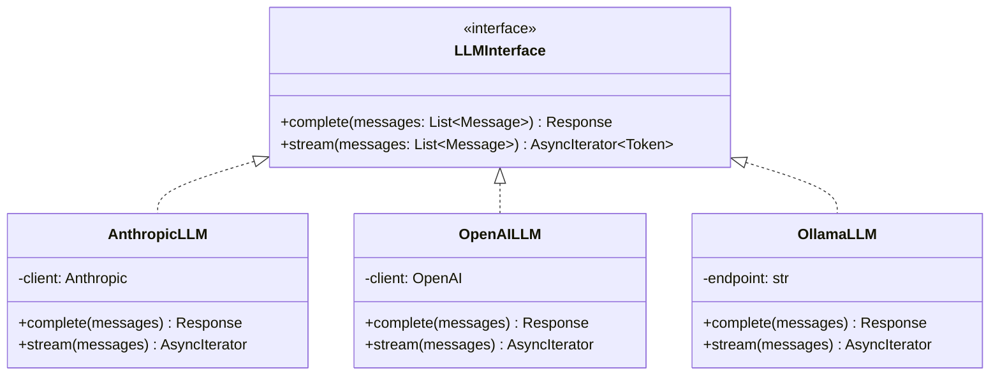
```mermaid
classDiagram
    class LLMInterface {
        <<interface>>
        +complete(messages: List~Message~) Response
        +stream(messages: List~Message~) AsyncIterator~Token~
    }
    
    class AnthropicLLM {
        -client: Anthropic
        +complete(messages) Response
        +stream(messages) AsyncIterator
    }
    
    class OpenAILLM {
        -client: OpenAI
        +complete(messages) Response
        +stream(messages) AsyncIterator
    }
    
    class OllamaLLM {
        -endpoint: str
        +complete(messages) Response
        +stream(messages) AsyncIterator
    }
    
    LLMInterface <|.. AnthropicLLM
    LLMInterface <|.. OpenAILLM
    LLMInterface <|.. OllamaLLM
```

### Message Flow

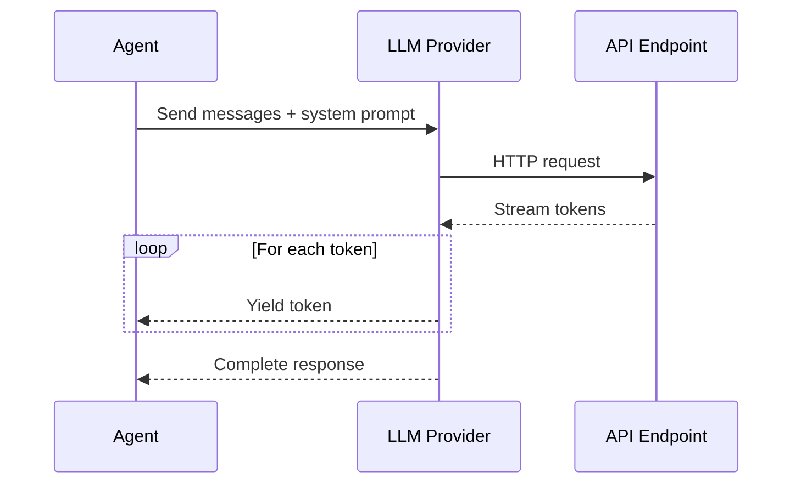
```mermaid
sequenceDiagram
    participant Agent
    participant LLM as LLM Provider
    participant API as API Endpoint
    
    Agent->>LLM: Send messages + system prompt
    LLM->>API: HTTP request
    API-->>LLM: Stream tokens
    loop For each token
        LLM-->>Agent: Yield token
    end
    LLM-->>Agent: Complete response
```

### Token Streaming

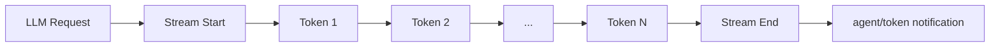
```mermaid
flowchart LR
    A[LLM Request] --> B[Stream Start]
    B --> C[Token 1]
    C --> D[Token 2]
    D --> E[...]
    E --> F[Token N]
    F --> G[Stream End]
    
    G --> H[agent/token notification]
```

## Tool System
{{status: done}}

### Tool Categories

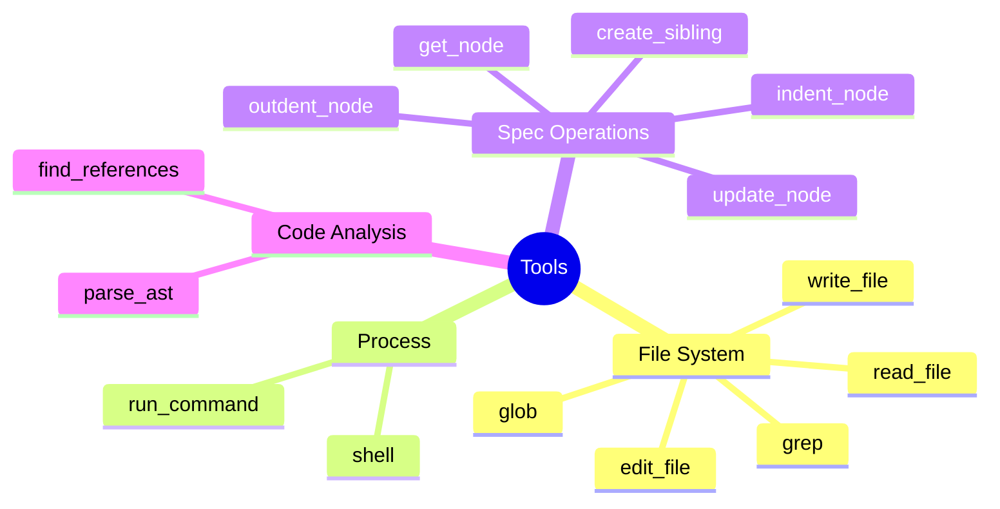
```mermaid
mindmap
  root((Tools))
    File System
      read_file
      write_file
      edit_file
      glob
      grep
    Process
      run_command
      shell
    Spec Operations
      get_node
      update_node
      create_sibling
      indent_node
      outdent_node
    Code Analysis
      parse_ast
      find_references
```

### Tool Interface

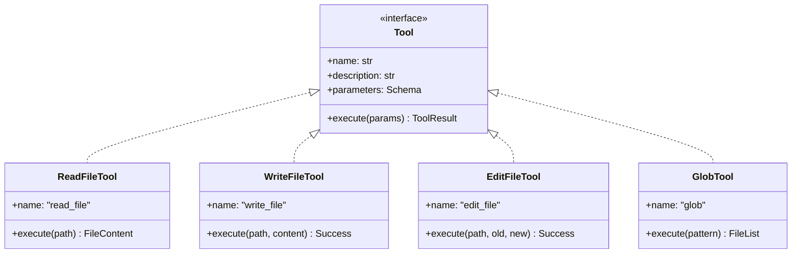
```mermaid
classDiagram
    class Tool {
        <<interface>>
        +name: str
        +description: str
        +parameters: Schema
        +execute(params) ToolResult
    }
    
    class ReadFileTool {
        +name: "read_file"
        +execute(path) FileContent
    }
    
    class WriteFileTool {
        +name: "write_file"
        +execute(path, content) Success
    }
    
    class EditFileTool {
        +name: "edit_file"
        +execute(path, old, new) Success
    }
    
    class GlobTool {
        +name: "glob"
        +execute(pattern) FileList
    }
    
    Tool <|.. ReadFileTool
    Tool <|.. WriteFileTool
    Tool <|.. EditFileTool
    Tool <|.. GlobTool
```

### Tool Execution Flow

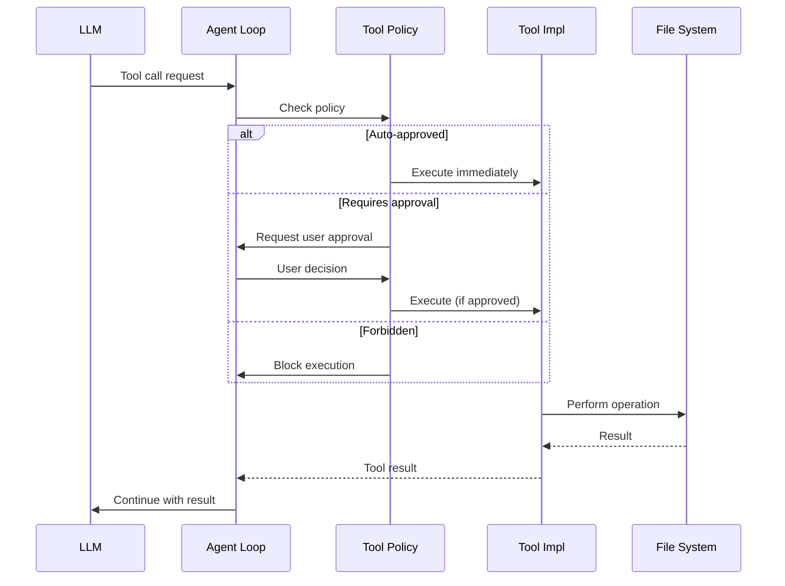
```mermaid
sequenceDiagram
    participant LLM
    participant Agent as Agent Loop
    participant Policy as Tool Policy
    participant Tool as Tool Impl
    participant FS as File System
    
    LLM->>Agent: Tool call request
    Agent->>Policy: Check policy
    alt Auto-approved
        Policy->>Tool: Execute immediately
    else Requires approval
        Policy->>Agent: Request user approval
        Agent->>Policy: User decision
        Policy->>Tool: Execute (if approved)
    else Forbidden
        Policy->>Agent: Block execution
    end
    Tool->>FS: Perform operation
    FS-->>Tool: Result
    Tool-->>Agent: Tool result
    Agent->>LLM: Continue with result
```

## Tool Policy System
{{status: done}}

### Policy Types

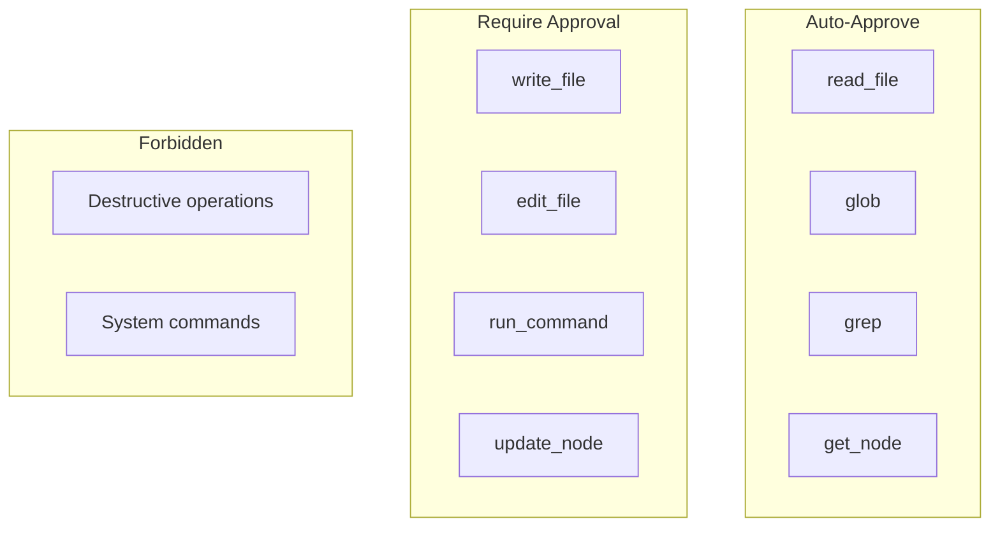
```mermaid
graph TB
    subgraph AutoApprove["Auto-Approve"]
        A1[read_file]
        A2[glob]
        A3[grep]
        A4[get_node]
    end
    
    subgraph RequireApproval["Require Approval"]
        R1[write_file]
        R2[edit_file]
        R3[run_command]
        R4[update_node]
    end
    
    subgraph Forbidden["Forbidden"]
        F1[Destructive operations]
        F2[System commands]
    end
```

### Policy Decision Flow

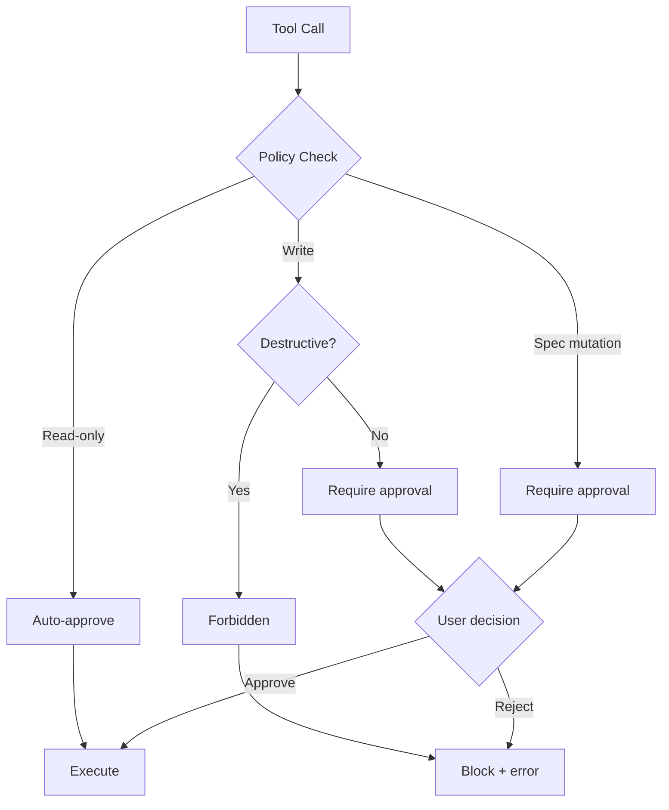
```mermaid
flowchart TD
    A[Tool Call] --> B{Policy Check}
    B -->|Read-only| C[Auto-approve]
    B -->|Write| D{Destructive?}
    D -->|Yes| E[Forbidden]
    D -->|No| F[Require approval]
    B -->|Spec mutation| G[Require approval]
    
    C --> H[Execute]
    E --> I[Block + error]
    F --> J{User decision}
    J -->|Approve| H
    J -->|Reject| I
    G --> J
```

## Clarification Handling
{{status: done}}

### Clarification Flow

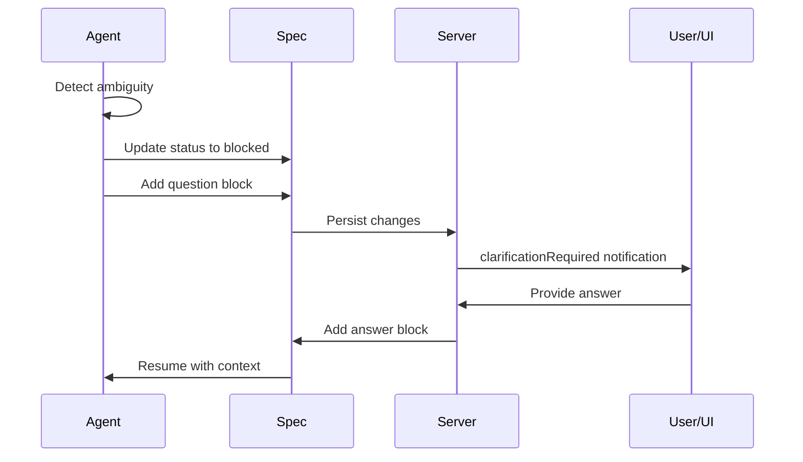
```mermaid
sequenceDiagram
    participant Agent
    participant Spec
    participant Server
    participant User as User/UI
    
    Agent->>Agent: Detect ambiguity
    Agent->>Spec: Update status to blocked
    Agent->>Spec: Add question block
    Spec->>Server: Persist changes
    Server->>User: clarificationRequired notification
    User->>Server: Provide answer
    Server->>Spec: Add answer block
    Spec->>Agent: Resume with context
```

### Question Generation

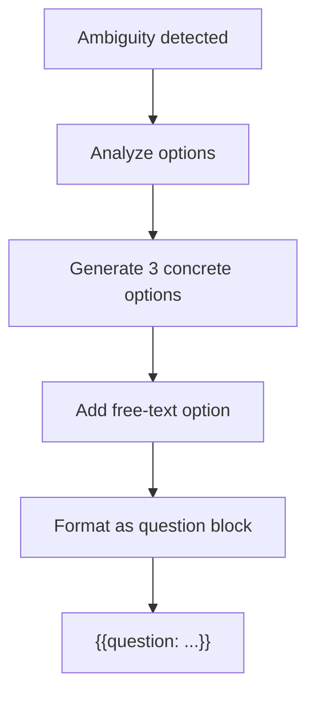
```mermaid
flowchart TD
    A[Ambiguity detected] --> B[Analyze options]
    B --> C[Generate 3 concrete options]
    C --> D[Add free-text option]
    D --> E[Format as question block]
    E --> F["{{question: ...}}"]
```

## Amendment System
{{status: done}}

### Amendment Flow

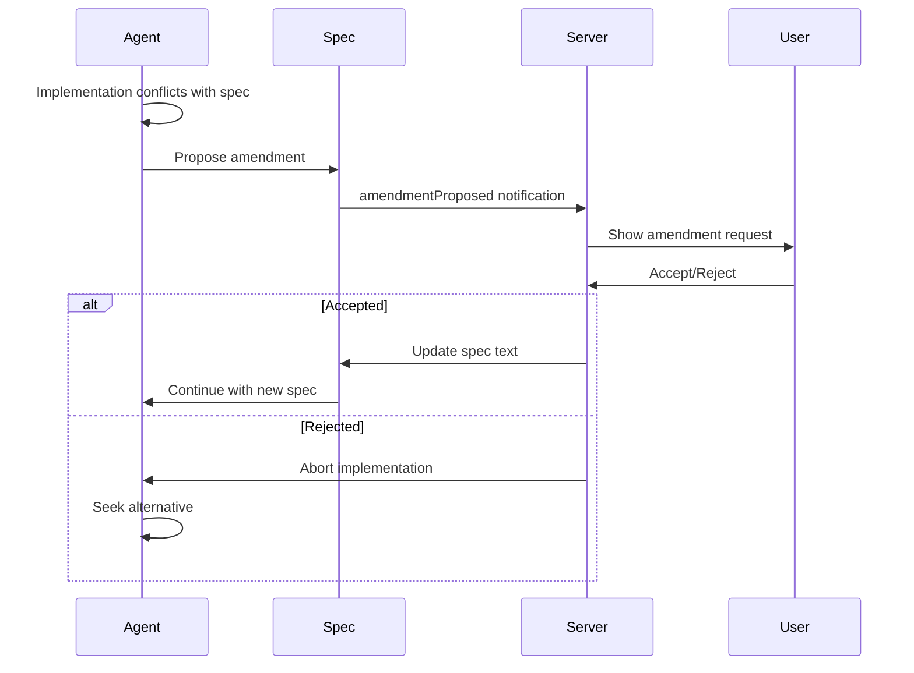
```mermaid
sequenceDiagram
    participant Agent
    participant Spec
    participant Server
    participant User
    
    Agent->>Agent: Implementation conflicts with spec
    Agent->>Spec: Propose amendment
    Spec->>Server: amendmentProposed notification
    Server->>User: Show amendment request
    User->>Server: Accept/Reject
    alt Accepted
        Server->>Spec: Update spec text
        Spec->>Agent: Continue with new spec
    else Rejected
        Server->>Agent: Abort implementation
        Agent->>Agent: Seek alternative
    end
```

### Amendment States

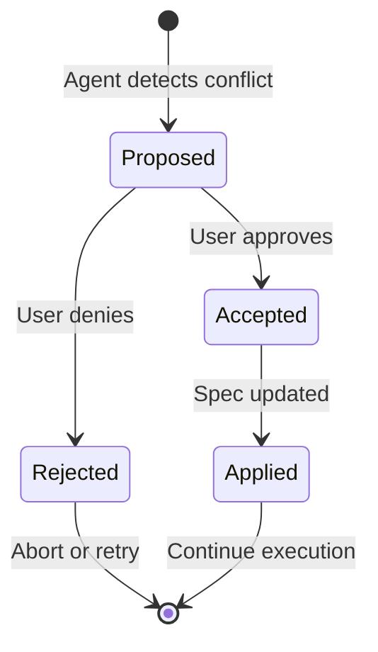
```mermaid
stateDiagram-v2
    [*] --> Proposed: Agent detects conflict
    Proposed --> Accepted: User approves
    Proposed --> Rejected: User denies
    Accepted --> Applied: Spec updated
    Rejected --> [*]: Abort or retry
    Applied --> [*]: Continue execution
```

## Execution History
{{status: done}}

### Database Schema

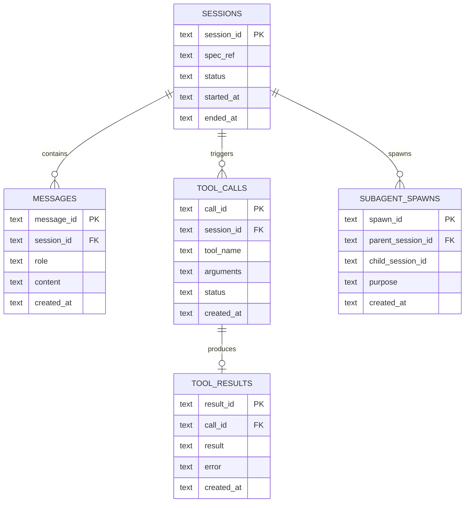
```mermaid
erDiagram
    SESSIONS {
        text session_id PK
        text spec_ref
        text status
        text started_at
        text ended_at
    }
    
    MESSAGES {
        text message_id PK
        text session_id FK
        text role
        text content
        text created_at
    }
    
    TOOL_CALLS {
        text call_id PK
        text session_id FK
        text tool_name
        text arguments
        text status
        text created_at
    }
    
    TOOL_RESULTS {
        text result_id PK
        text call_id FK
        text result
        text error
        text created_at
    }
    
    SUBAGENT_SPAWNS {
        text spawn_id PK
        text parent_session_id FK
        text child_session_id
        text purpose
        text created_at
    }
    
    SESSIONS ||--o{ MESSAGES : contains
    SESSIONS ||--o{ TOOL_CALLS : triggers
    TOOL_CALLS ||--o| TOOL_RESULTS : produces
    SESSIONS ||--o{ SUBAGENT_SPAWNS : spawns
```

### History Tracking

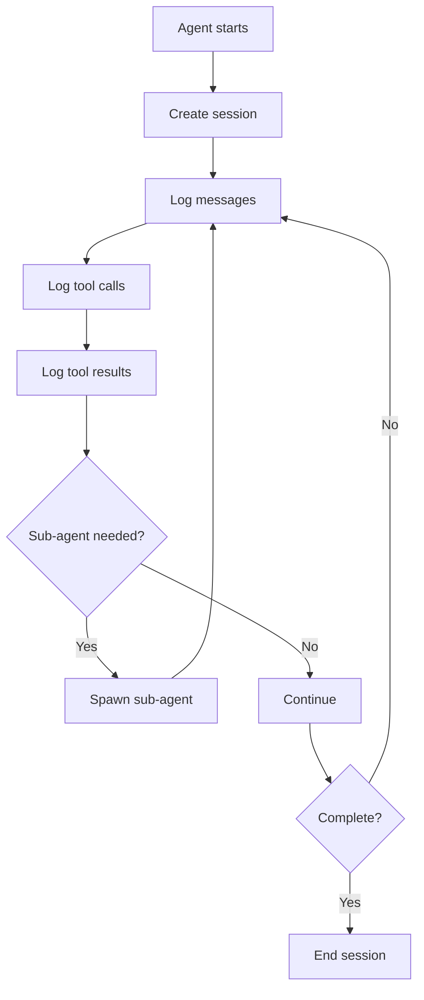
```mermaid
flowchart TD
    A[Agent starts] --> B[Create session]
    B --> C[Log messages]
    C --> D[Log tool calls]
    D --> E[Log tool results]
    E --> F{Sub-agent needed?}
    F -->|Yes| G[Spawn sub-agent]
    G --> C
    F -->|No| H[Continue]
    H --> I{Complete?}
    I -->|No| C
    I -->|Yes| J[End session]
```

## Approval Flow
{{status: done}}

### Approval Request Flow

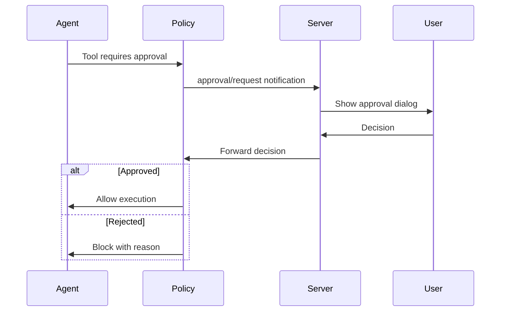
```mermaid
sequenceDiagram
    participant Agent
    participant Policy
    participant Server
    participant User
    
    Agent->>Policy: Tool requires approval
    Policy->>Server: approval/request notification
    Server->>User: Show approval dialog
    User->>Server: Decision
    Server->>Policy: Forward decision
    alt Approved
        Policy->>Agent: Allow execution
    else Rejected
        Policy->>Agent: Block with reason
    end
```

### Approval UI Flow

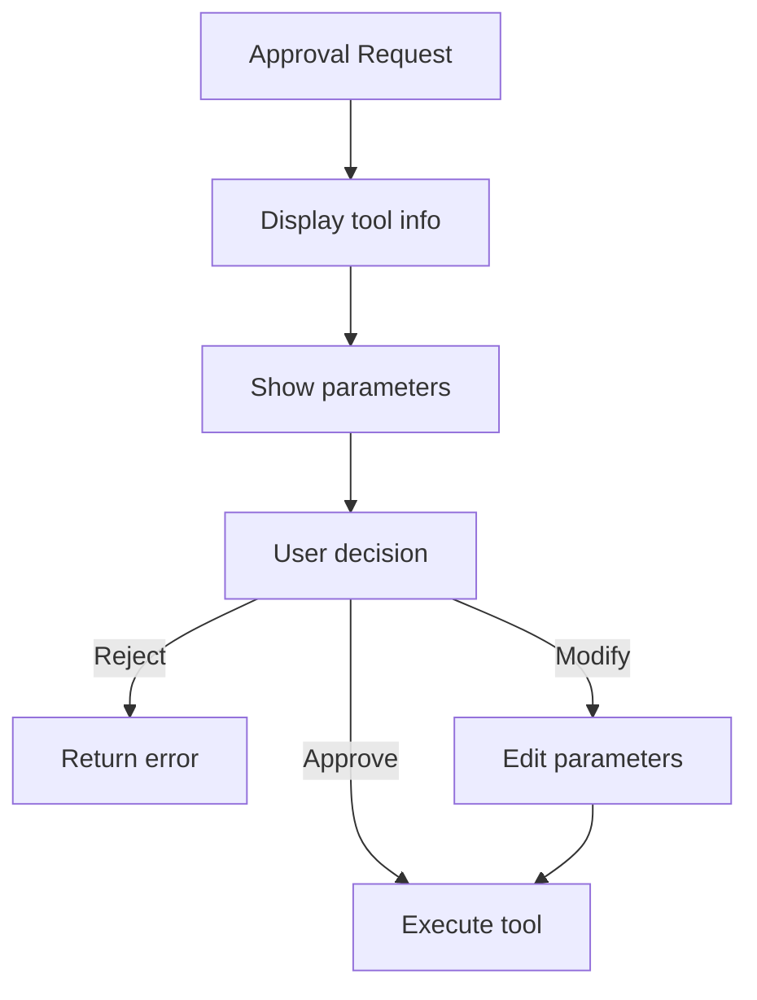
```mermaid
flowchart TD
    A[Approval Request] --> B[Display tool info]
    B --> C[Show parameters]
    C --> D[User decision]
    D -->|Approve| E[Execute tool]
    D -->|Reject| F[Return error]
    D -->|Modify| G[Edit parameters]
    G --> E
```

## Error Handling
{{status: done}}

### Error Recovery

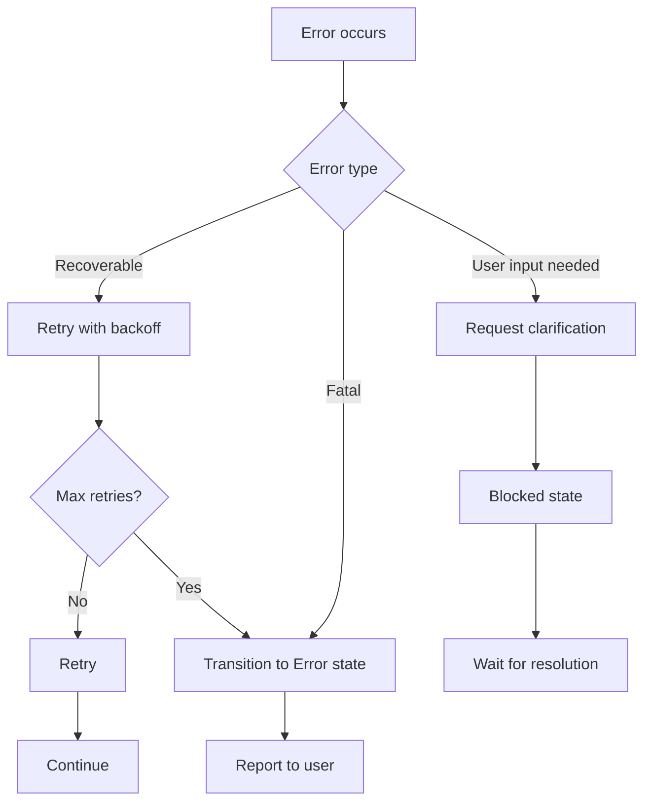
```mermaid
flowchart TD
    A[Error occurs] --> B{Error type}
    B -->|Recoverable| C[Retry with backoff]
    B -->|User input needed| D[Request clarification]
    B -->|Fatal| E[Transition to Error state]
    C --> F{Max retries?}
    F -->|No| G[Retry]
    F -->|Yes| E
    G --> H[Continue]
    D --> I[Blocked state]
    E --> J[Report to user]
    I --> K[Wait for resolution]
```
