# Backend Architecture
{{status: done}}

The Python backend is built on FastAPI and provides a WebSocket-based JSON-RPC 2.0 API for spec management and agent orchestration.

## Directory Structure
{{status: done}}

```
taui/
├── __init__.py
├── __main__.py          # CLI entry point
├── agent/               # Agent orchestration
│   ├── loop.py          # Main agent loop
│   ├── state.py         # Agent state machine
│   └── tool_policy.py   # Tool execution policies
├── auth/                # Authentication
├── config/              # Configuration management
├── llm/                 # LLM abstraction
│   └── base.py          # LLM interface
├── llms/                # LLM provider implementations
│   ├── anthropic.py
│   ├── openai.py
│   └── ...
├── logging.py           # Logging utilities
├── server/              # HTTP/WebSocket server
│   ├── __main__.py      # Server entry point
│   ├── app.py           # FastAPI app
│   └── protocol.py      # JSON-RPC protocol
├── specs/               # Spec management
│   ├── db.py            # SQLite database
│   ├── markdown.py      # Markdown parsing
│   ├── service.py       # Spec business logic
│   └── sync.py          # File synchronization
└── tools/               # Tool implementations
    ├── base.py
    ├── fs.py
    └── ...
```

## Server Layer
{{status: done}}

### Startup Sequence

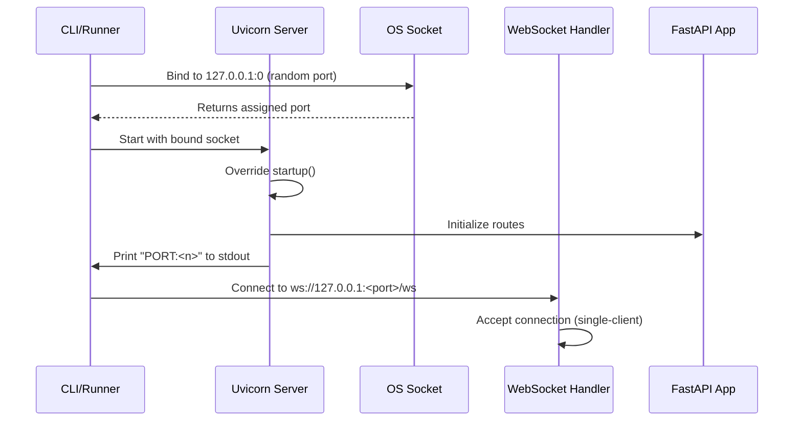

### Connection Management

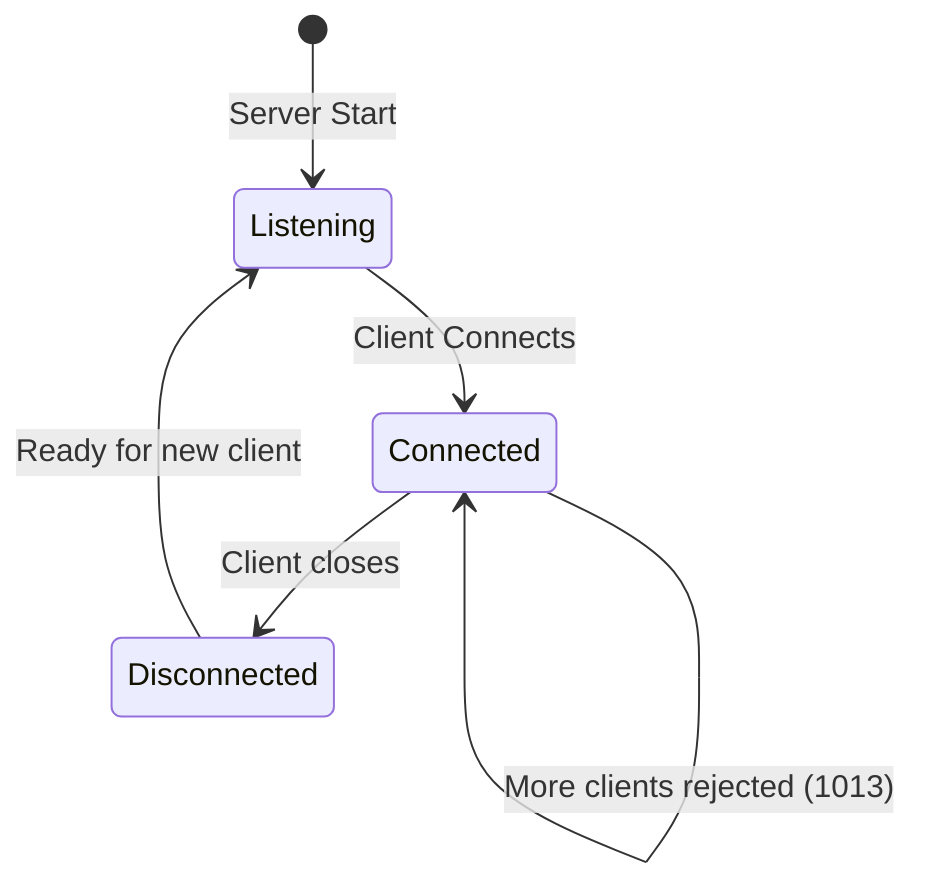

### Key Components

#### Port Binding Pattern
{{status: done}}

The server uses a deliberate port-binding race-prevention pattern:

1. A raw `socket.socket` is bound to `127.0.0.1:0`
2. OS assigns a free port, socket kept open
3. Uvicorn started with pre-bound socket
4. `PORT:<n>` printed only after Uvicorn enters accept loop

{{code_ref: `taui/server/__main__.py`}}

#### Single-Client Enforcement
{{status: done}}

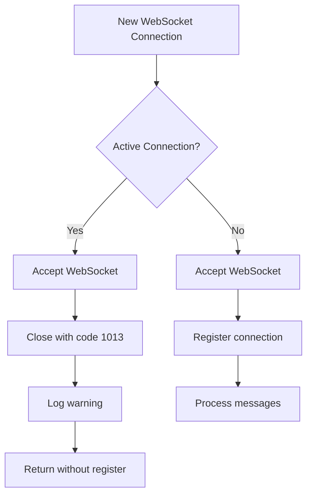

## Spec Management Layer
{{status: done}}

### Database Schema

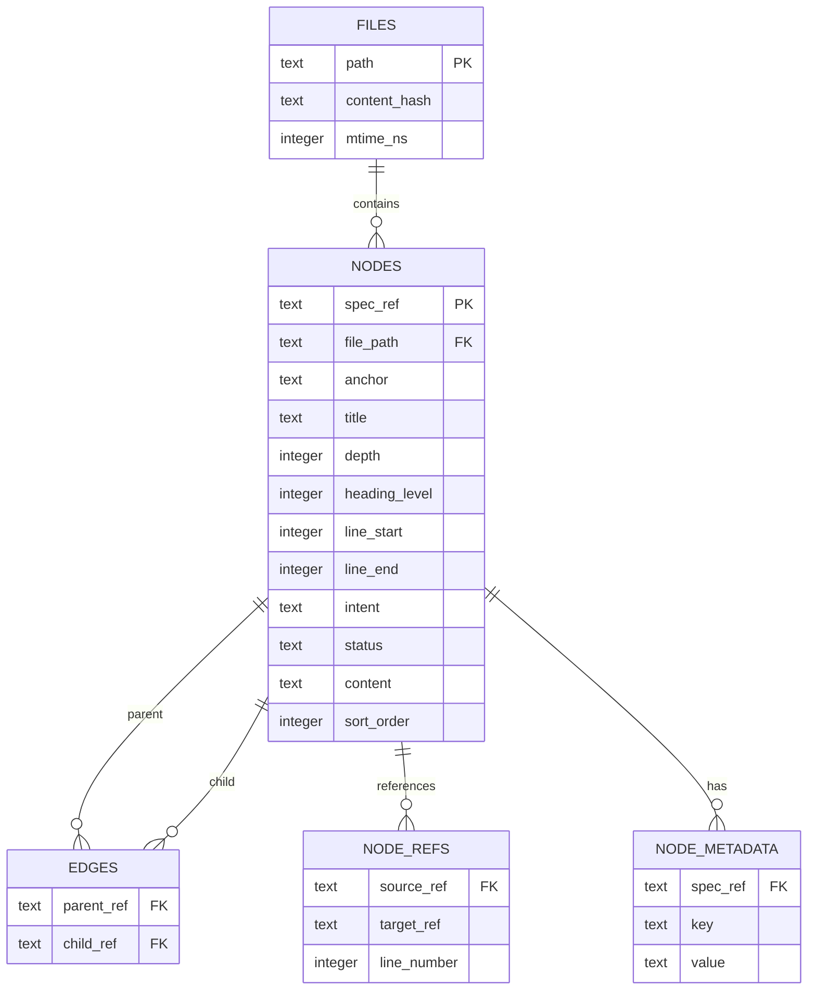

### Spec Synchronization Flow

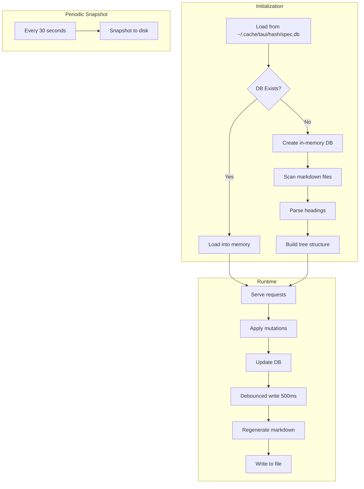

## Agent Layer
{{status: done}}

### Agent Loop Architecture

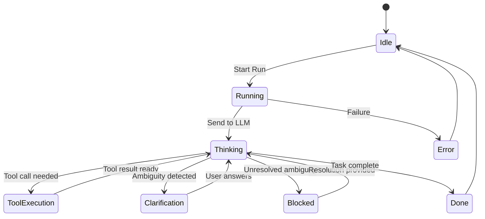

### Tool Policy System

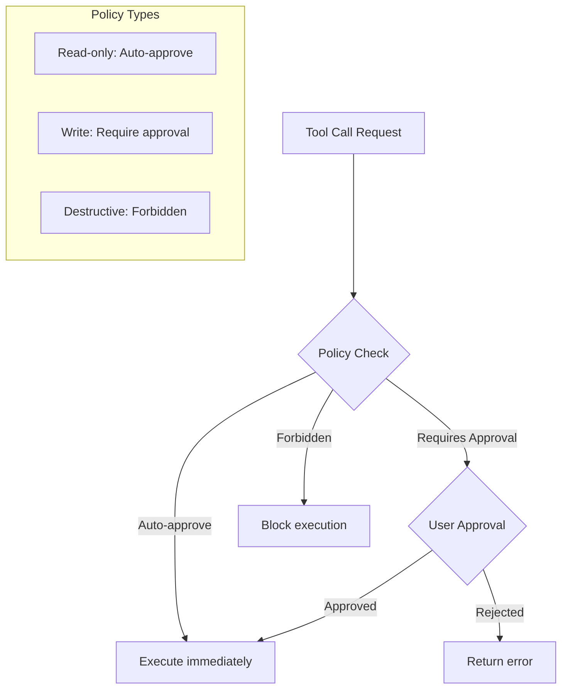

### LLM Integration

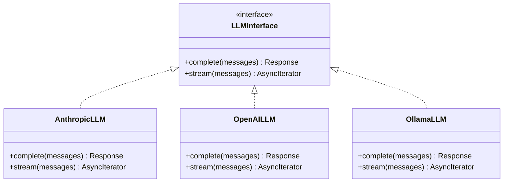

## Tool System
{{status: done}}

### Available Tools

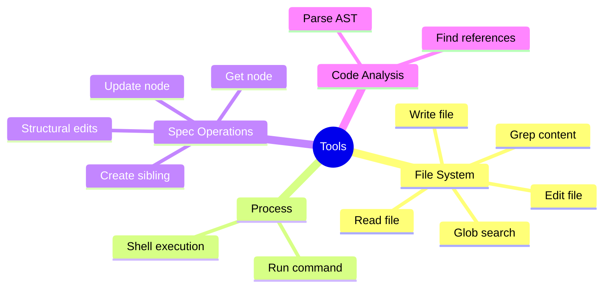

### Tool Execution Flow

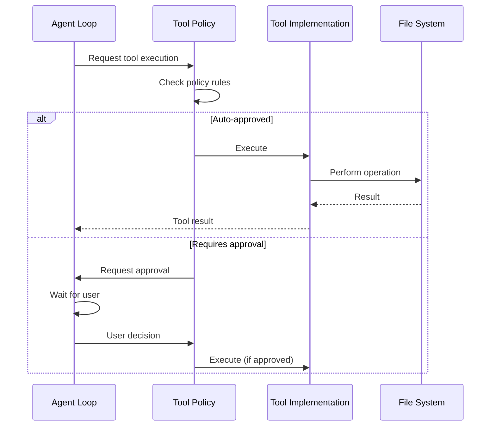

## Error Handling
{{status: done}}

### Error Propagation

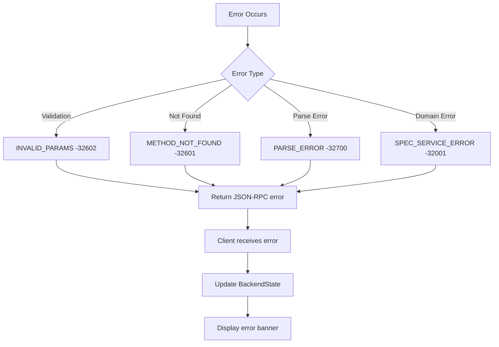
