# Data Models
{{status: done}}

This document covers the data models used across the Taui system, including both Python backend and Rust frontend types.

## Backend Data Models (Python)
{{status: done}}

### SpecNode Types

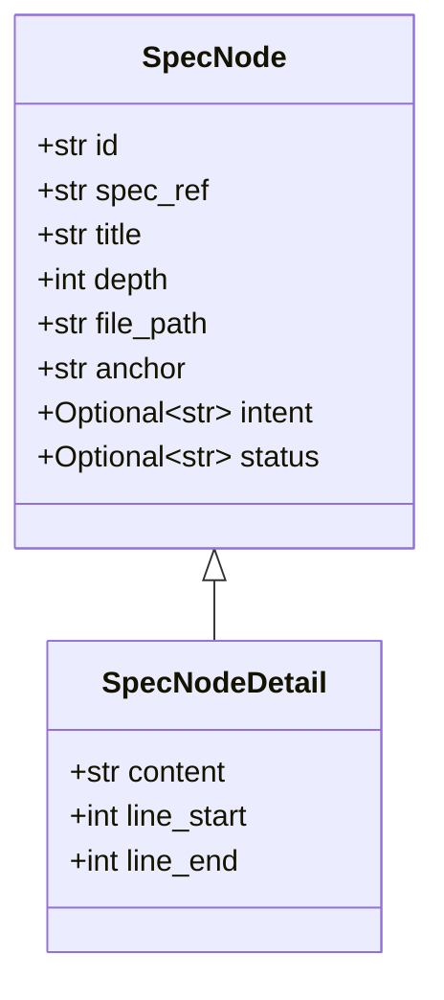

### Tree Response Types

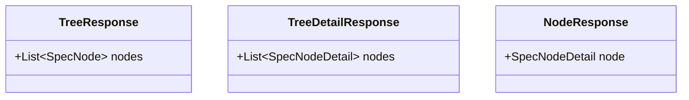

### Mutation Response Types

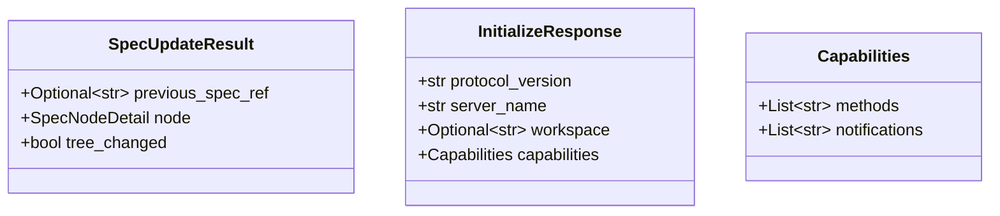

### Process Types

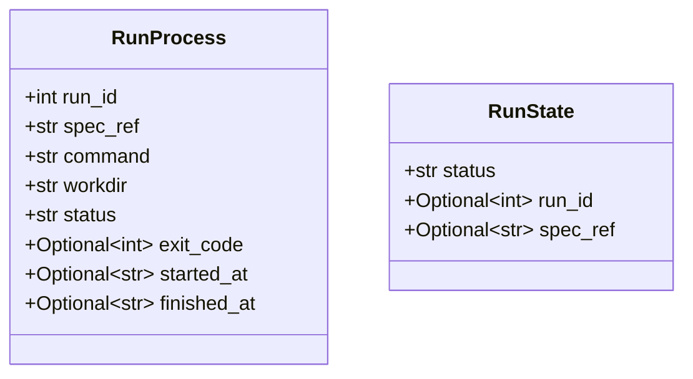

### Code Reference Types

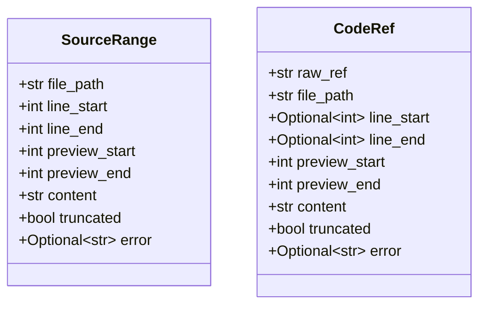

## Frontend Data Models (Rust)
{{status: done}}

### Core Node Types

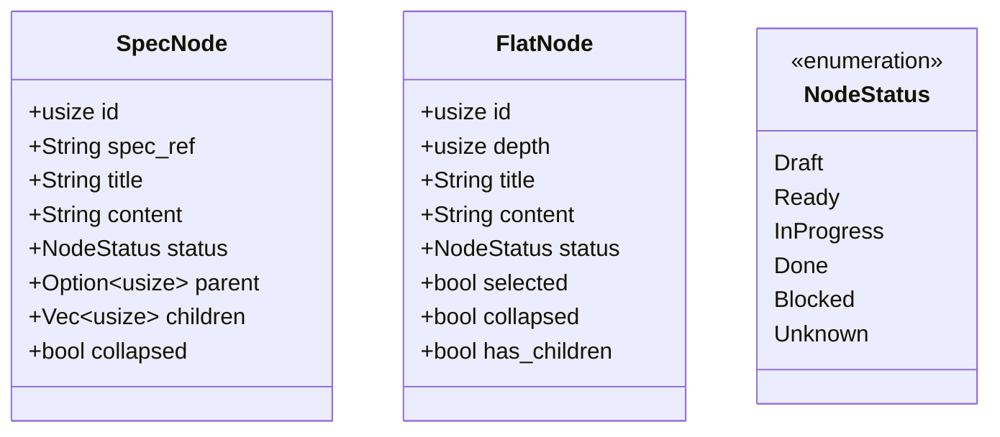

### AppState

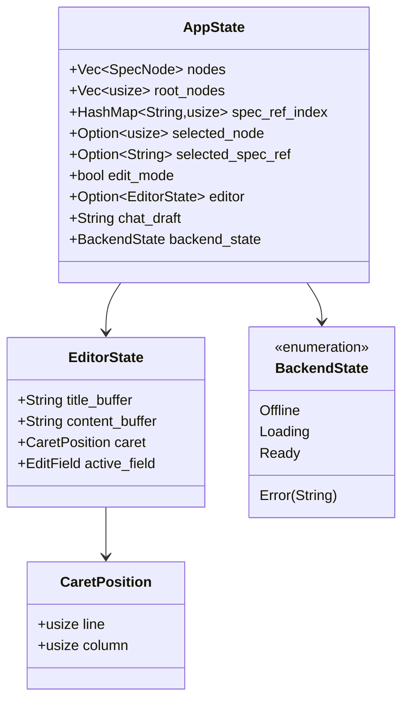

### Backend Client Types

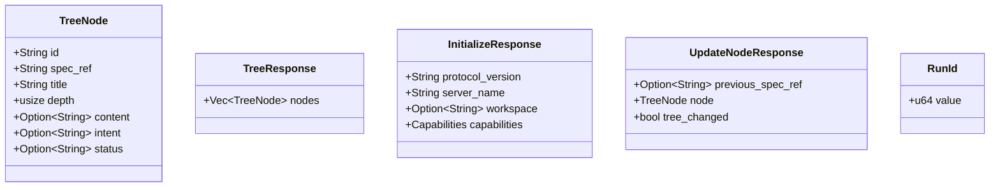

### UI Action Types

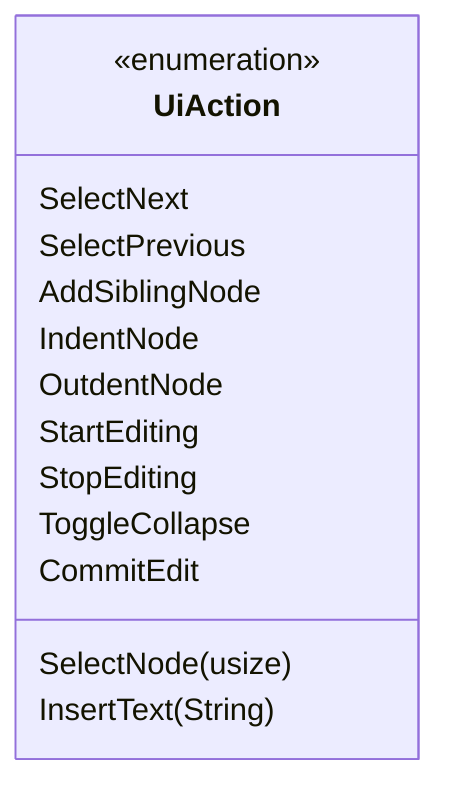

## JSON-RPC Types
{{status: done}}

### Request/Response

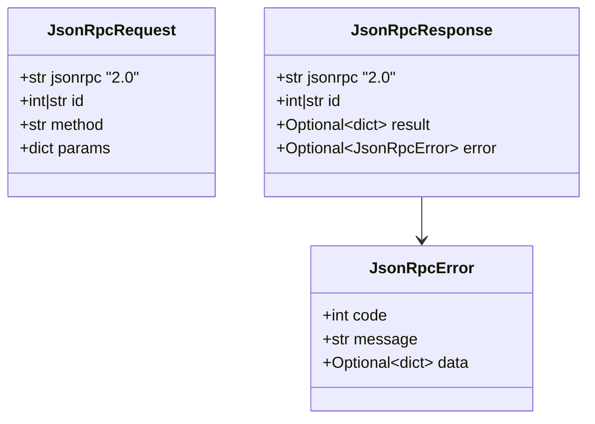

### Notification Types

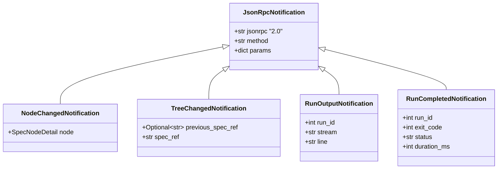

## Type Mappings
{{status: done}}

### Python to Rust Type Mapping

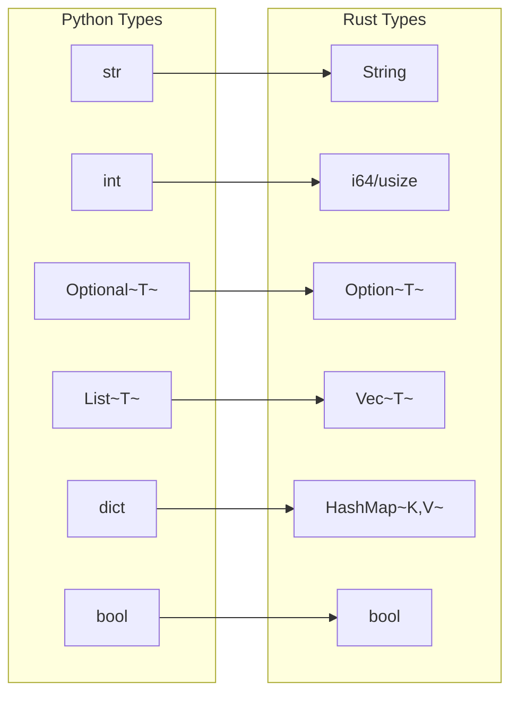

### Status Mapping

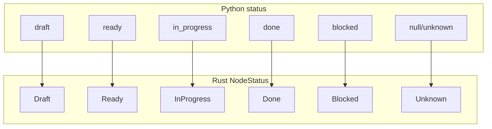

## Database Schema
{{status: done}}

### Core Tables

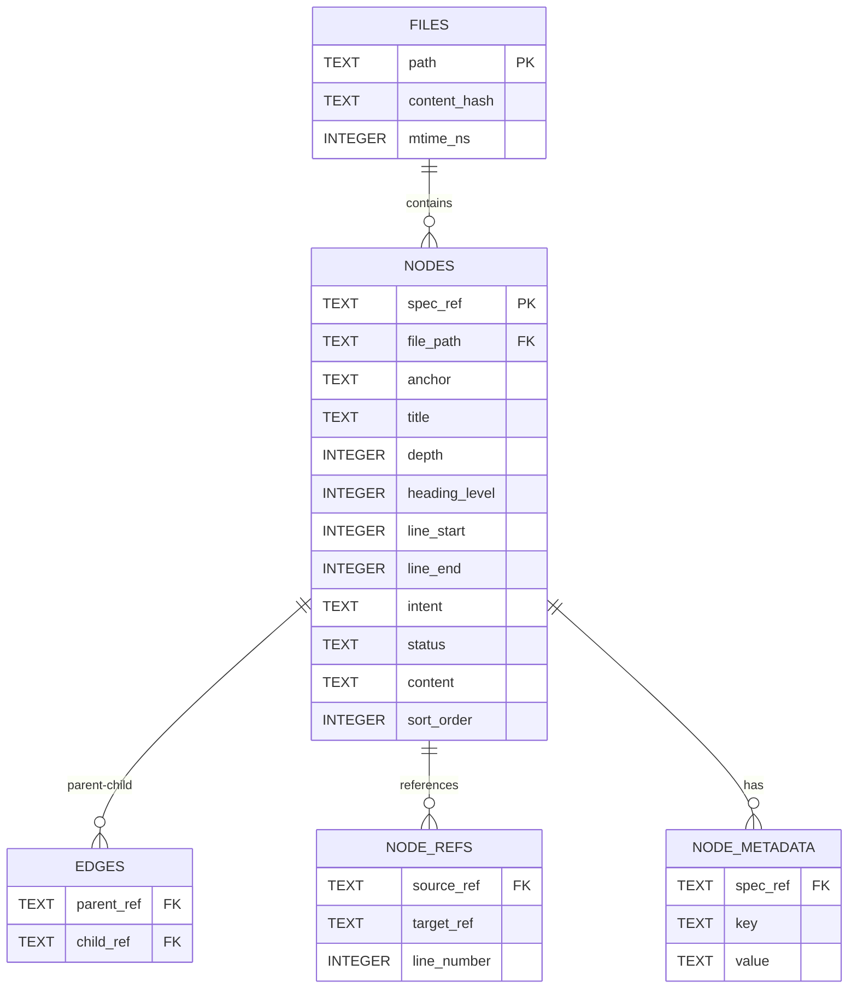

### Agent History Tables

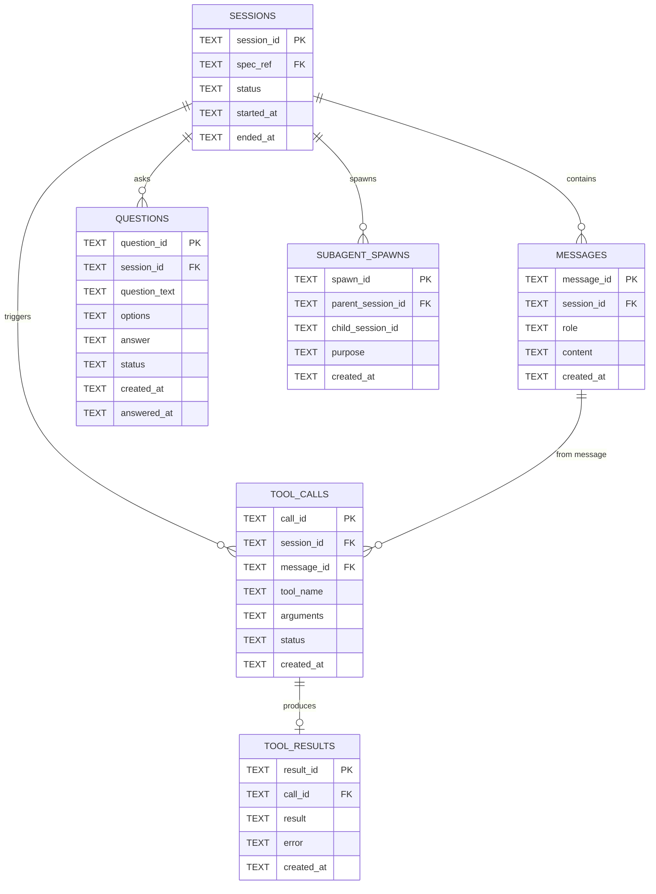

## Type Aliases
{{status: done}}

### Common Type Aliases

| Alias | Type | Purpose |
|-------|------|---------|
| `NodeId` | `usize` | Index into nodes arena |
| `SpecRef` | `String` | Canonical spec reference |
| `RequestID` | `int \| str` | JSON-RPC request ID |

### SpecRef Format

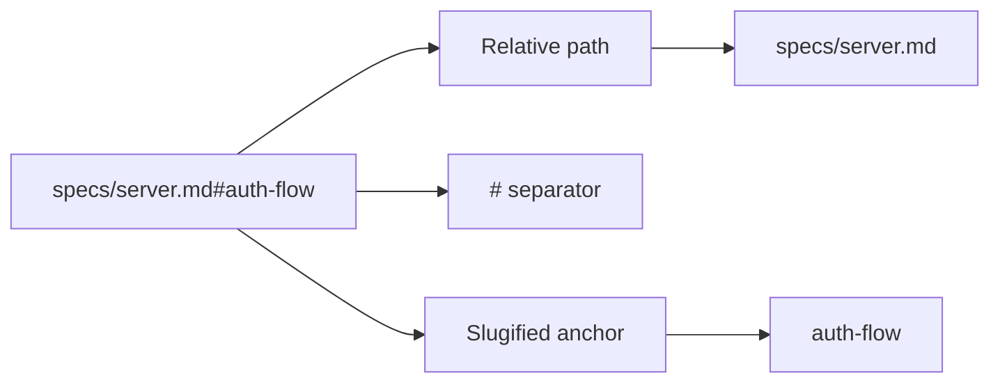
