# Frontend Architecture
{{status: done}}

The Rust GPUI frontend provides a native, GPU-accelerated user interface for interacting with the Taui spec tree and agent system.

## Directory Structure
{{status: done}}

```
ui/
├── Cargo.toml           # Dependencies: gpui, gpui-component, tokio
├── src/
│   ├── main.rs          # Binary entry (3 lines)
│   ├── lib.rs           # Module exports
│   ├── app/             # Core application
│   │   ├── mod.rs       # AppShell - root component
│   │   ├── actions.rs   # UiAction enum + reducer
│   │   ├── keybindings.rs # Key → Action mapping
│   │   ├── state.rs     # AppState domain model
│   │   ├── component_adapters.rs # Widget factories
│   │   └── typography.rs # Layout constants
│   ├── panes/           # UI panels
│   │   ├── mod.rs
│   │   ├── spec_tree.rs # Spec tree view
│   │   ├── chat.rs      # Chat interface
│   │   ├── plan_status.rs # Task DAG view
│   │   └── execution.rs # Agent event stream
│   ├── services/        # I/O layer
│   │   ├── mod.rs
│   │   ├── backend_client.rs # WebSocket client
│   │   ├── event_stream.rs   # Event subscription
│   │   └── spec_index.rs     # Markdown indexer
│   └── theme/           # Design tokens
│       ├── mod.rs
│       ├── colors.rs    # UI colors
│       ├── status_colors.rs # Status semantic colors
│       ├── syntax.rs    # Syntax highlighting
│       └── registry.rs  # Theme management
├── specs/               # Self-documenting specs
└── tests/               # Integration tests
```

## GPUI Patterns
{{status: done}}

### Application Bootstrap

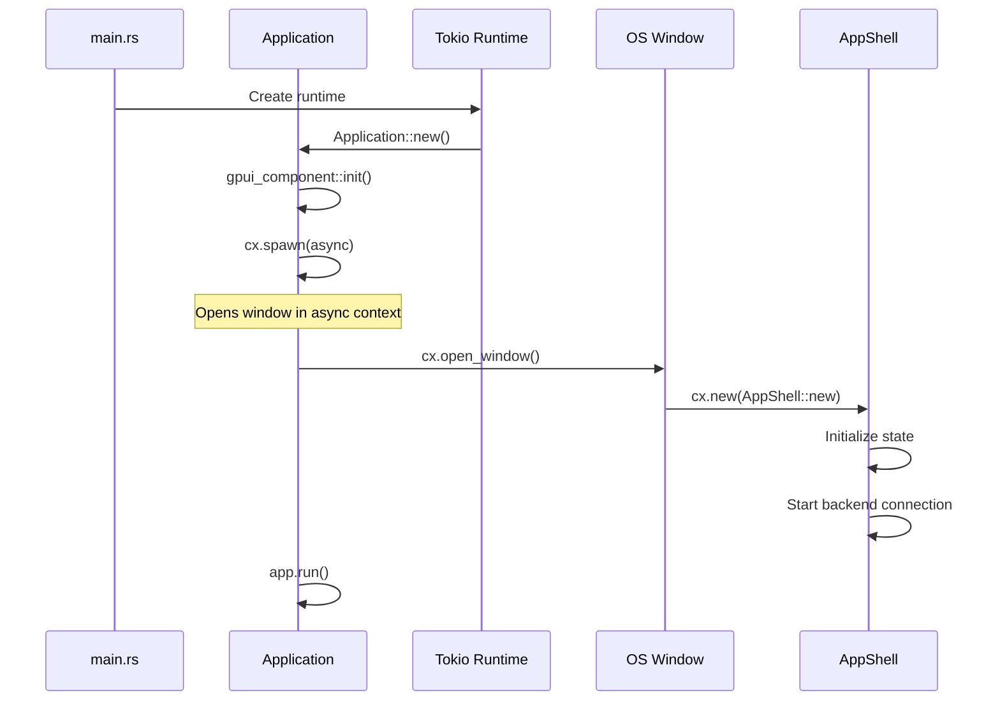

### Component Lifecycle

```mermaid
stateDiagram-v2
    [*] --> Created: cx.new(Entity::new)
    Created --> Mounted: Added to window
    Mounted --> Rendering: cx.notify()
    Rendering --> Mounted: Render complete
    Mounted --> Updating: State mutation
    Updating --> Rendering: cx.notify()
    Mounted --> Destroyed: Entity dropped
    Destroyed --> [*]
```

### Key GPUI Concepts

| Concept | Purpose | Example |
|---------|---------|---------|
| `Entity<T>` | Reference-counted component | `Entity<AppShell>` |
| `Context<T>` | Component context for mutations | `cx: &mut Context<AppShell>` |
| `FocusHandle` | Keyboard focus tracking | `self.focus_handle` |
| `cx.spawn` | Async task spawning | Network I/O |
| `cx.notify()` | Schedule re-render | After state change |
| `cx.listener` | Event callback creation | Click handlers |
| `cx.subscribe_in` | Entity event subscription | Input blur events |

## App Shell
{{status: done}}

### Structure

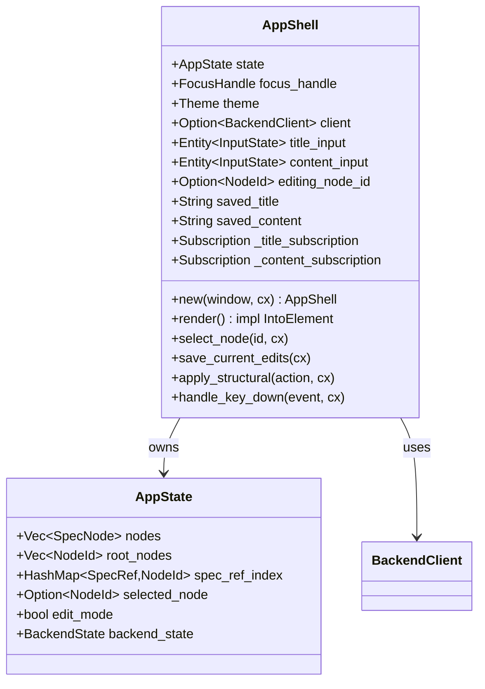

### Render Pipeline

```mermaid
flowchart TD
    A[render() called] --> B[Check BackendState]
    B -->|Loading| C[Show loading banner]
    B -->|Error| D[Show error banner]
    B -->|Ready| E[Render main UI]
    
    E --> F[Flatten tree nodes]
    F --> G[Render root header]
    G --> H[For each node]
    H --> I{Is selected?}
    I -->|Yes| J[Render with Input widgets]
    I -->|No| K[Render static div]
    J --> L[Add toolbar]
    K --> M[Add click handler]
    L --> N[Next node]
    M --> N
    N --> H
```

## State Management
{{status: done}}

### Action Dispatch Pattern

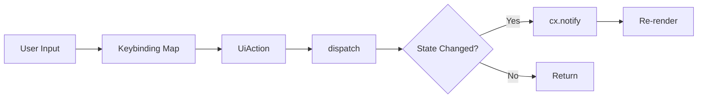

### UiAction Types

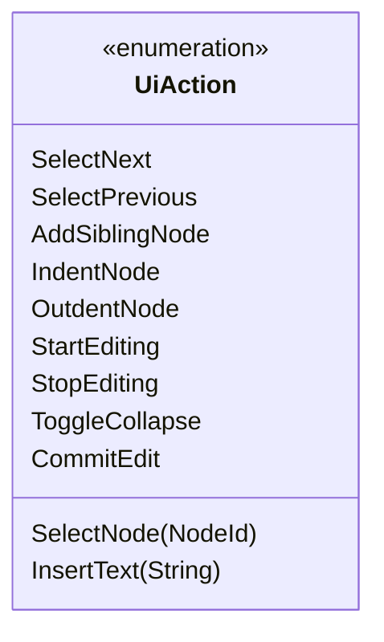

### Tree Flattening

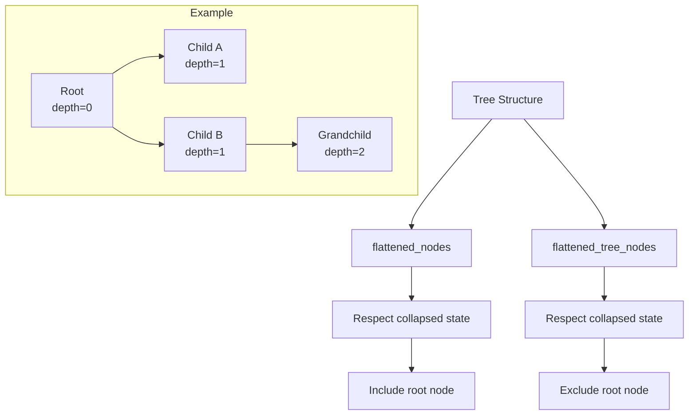

## Panes Module
{{status: done}}

### Pane Architecture

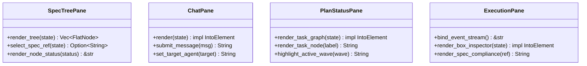

### Current Pane Status

| Pane | Status | Implementation |
|------|--------|----------------|
| SpecTreePane | Live | Used in AppShell |
| ChatPane | Stub | Not mounted |
| PlanStatusPane | Stub | Not mounted |
| ExecutionPane | Stub | Not mounted |

## Services Module
{{status: done}}

### Backend Client

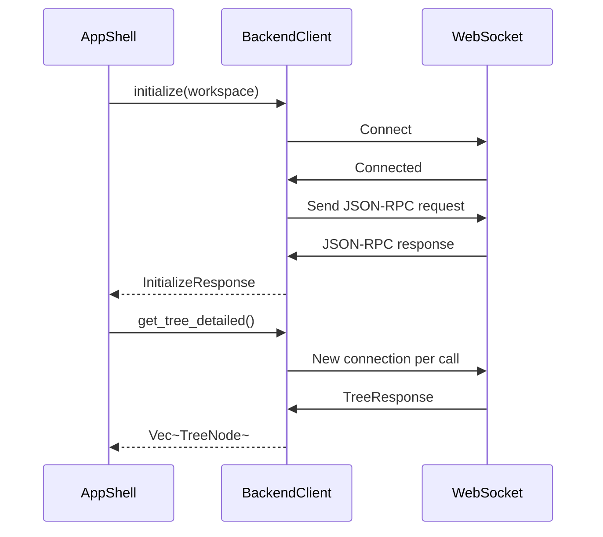

### RPC Methods

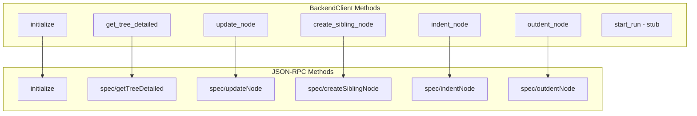

### Connection Pattern (Current)

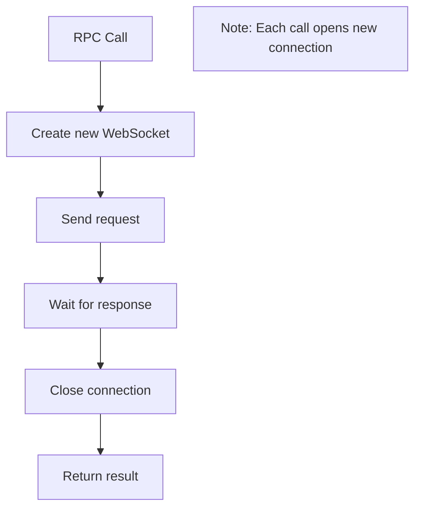

## Theme System
{{status: done}}

### Theme Structure

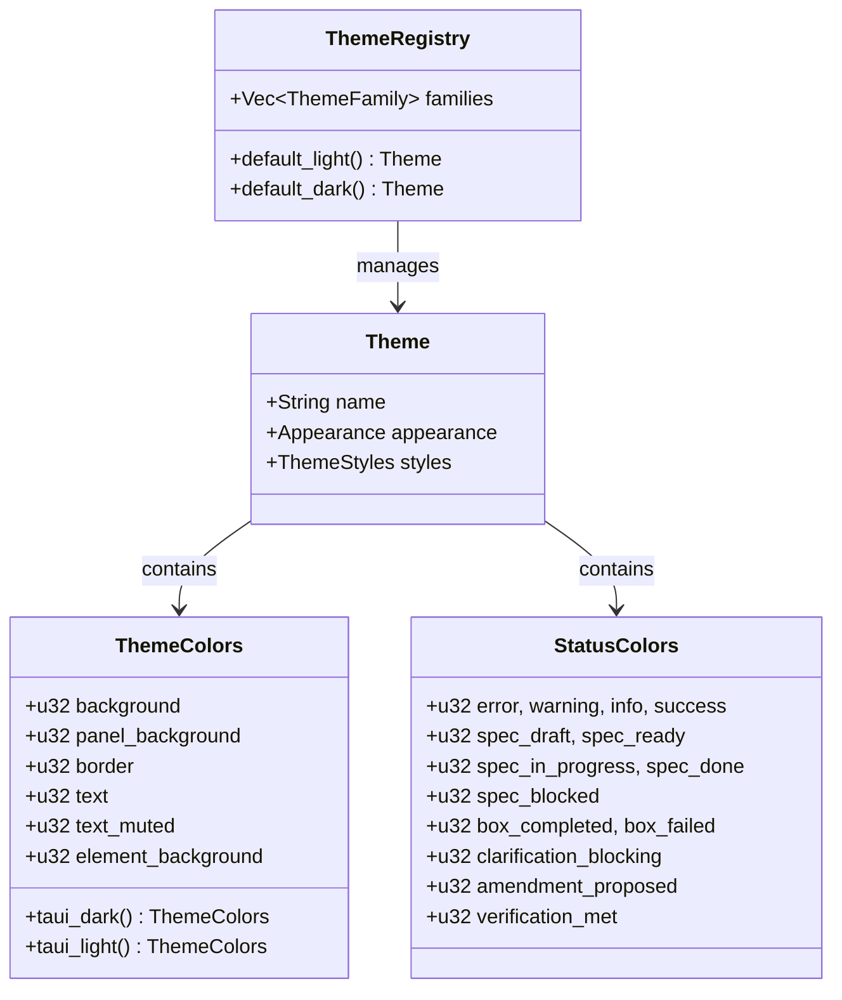

### Built-in Themes

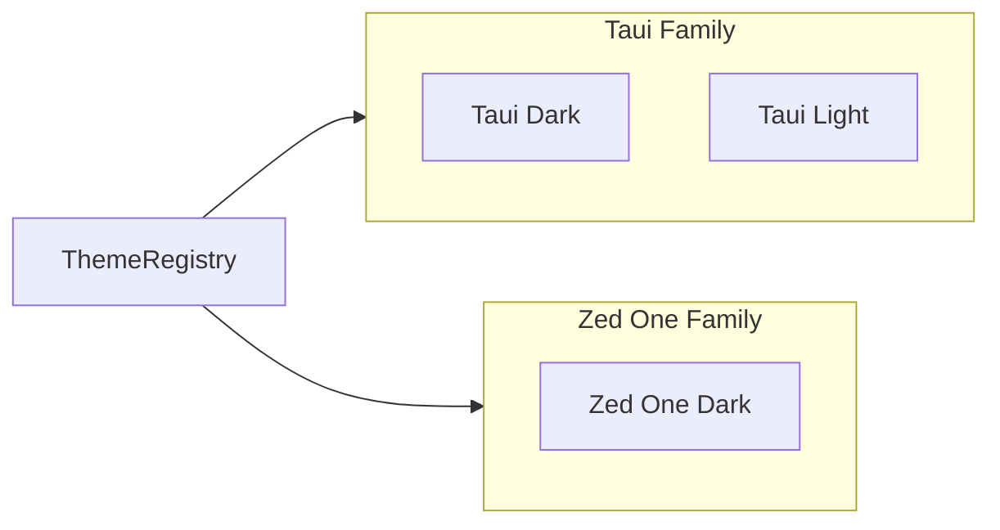

## Typography
{{status: done}}

### Heading Style Mapping

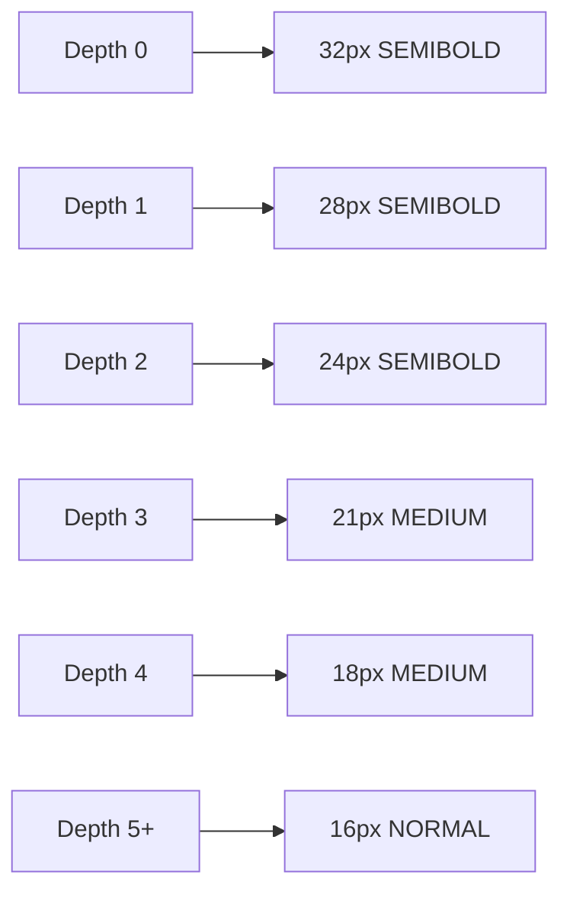

### Layout Constants

| Constant | Value | Purpose |
|----------|-------|---------|
| MAX_CONTENT_WIDTH | 960px | Document column width |
| INDENT_PER_LEVEL | 24px | Tree indent increment |

## Testing
{{status: done}}

### Test Structure

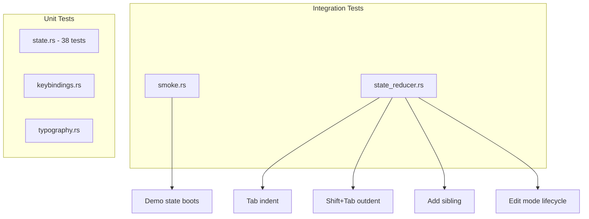
