# IPC Protocol
{{status: done}}

Taui uses JSON-RPC 2.0 over WebSocket for all communication between the Python backend and Rust frontend.

## Protocol Overview
{{status: done}}

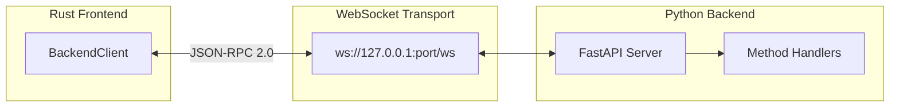

## Message Formats
{{status: done}}

### Request Format

```json
{
  "jsonrpc": "2.0",
  "id": 42,
  "method": "spec/getTree",
  "params": {}
}
```

### Success Response

```json
{
  "jsonrpc": "2.0",
  "id": 42,
  "result": { ... }
}
```

### Error Response

```json
{
  "jsonrpc": "2.0",
  "id": 42,
  "error": {
    "code": -32601,
    "message": "Method not found",
    "data": { "code": "spec_not_found" }
  }
}
```

### Notification (Server → Client)

```json
{
  "jsonrpc": "2.0",
  "method": "spec/nodeChanged",
  "params": { "node": { ... } }
}
```

## Error Codes
{{status: done}}

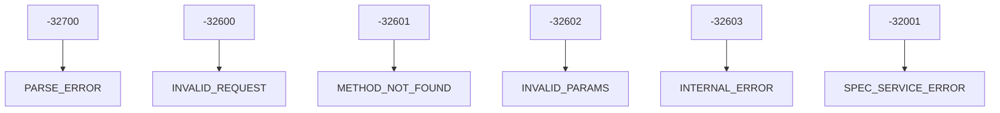

| Code | Name | Description |
|------|------|-------------|
| -32700 | PARSE_ERROR | Malformed JSON |
| -32600 | INVALID_REQUEST | Bad jsonrpc version/id |
| -32601 | METHOD_NOT_FOUND | Unknown method |
| -32602 | INVALID_PARAMS | Validation failure |
| -32603 | INTERNAL_ERROR | Server error |
| -32001 | SPEC_SERVICE_ERROR | Domain error |

## RPC Methods
{{status: done}}

### Session Lifecycle

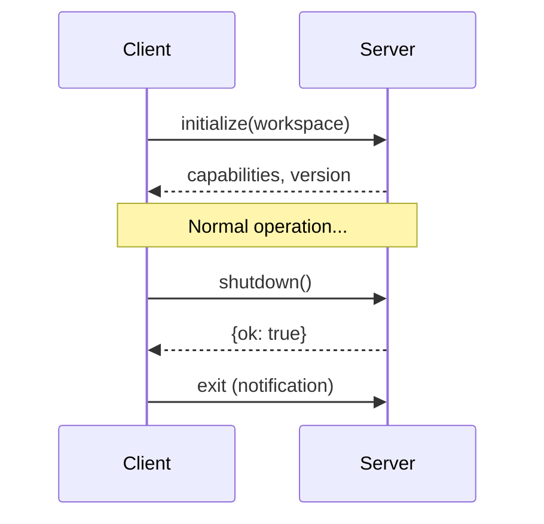

### Spec Tree Reads

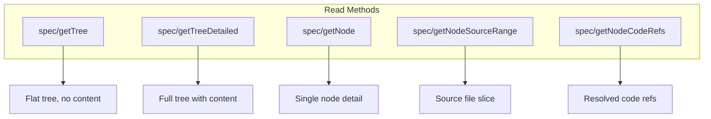

### Spec Tree Mutations

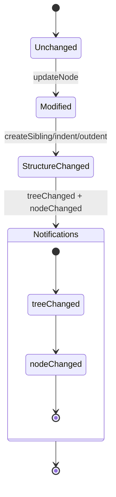

### Process Execution

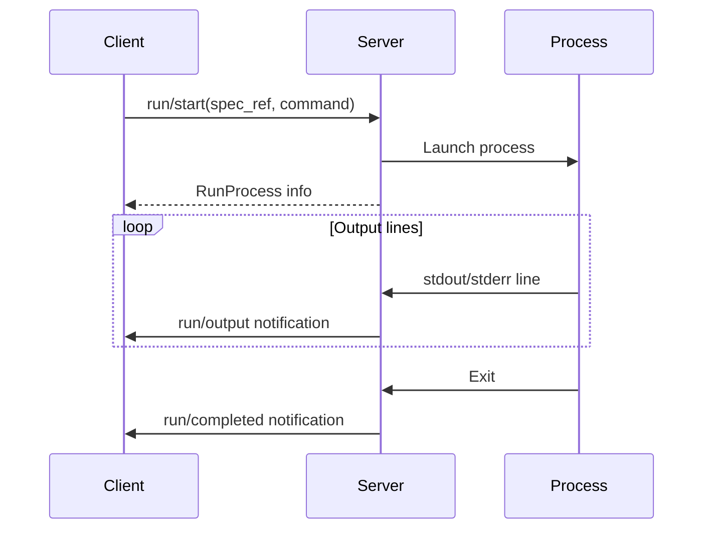

## Notifications
{{status: done}}

### Notification Types

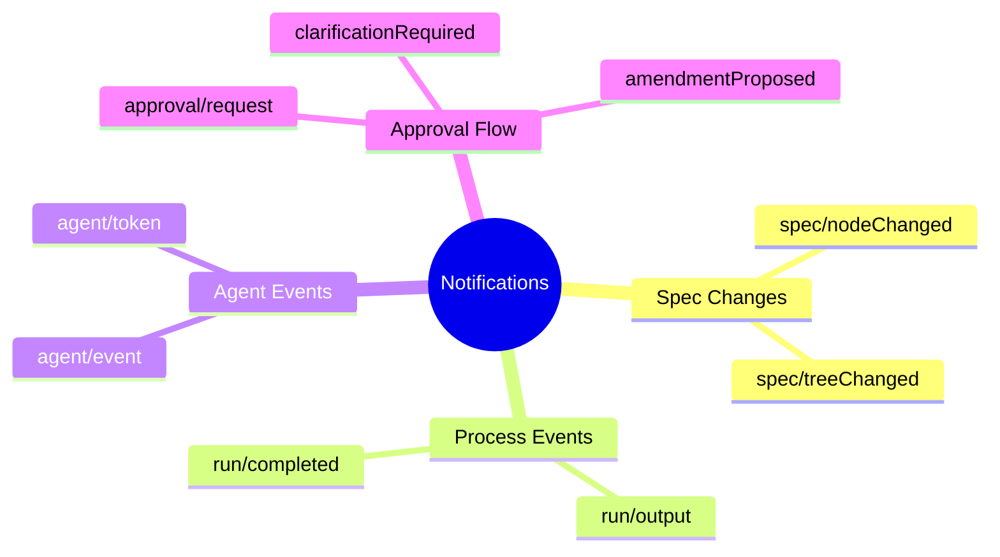

### Notification Flow

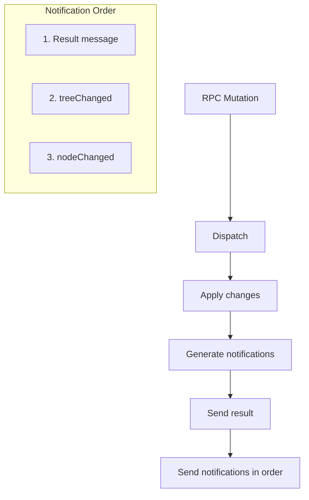

## Data Types
{{status: done}}

### SpecNode

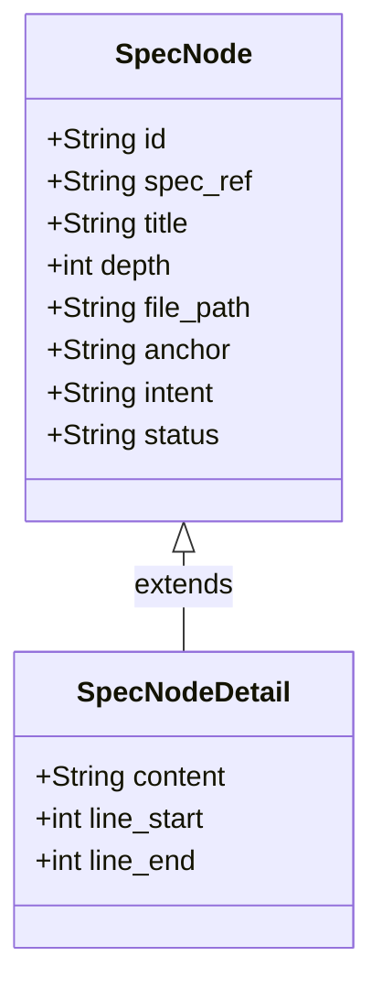

### SpecUpdateResult

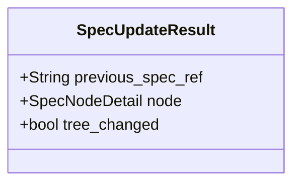

### Process Types

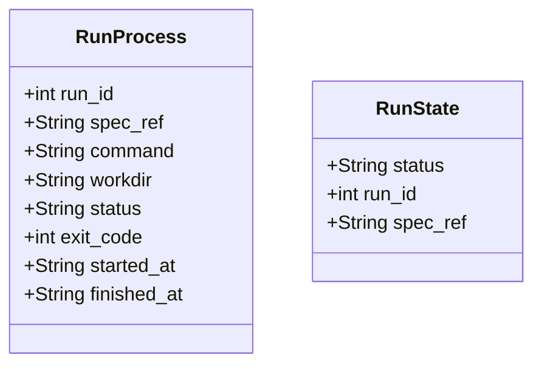

## State Synchronization
{{status: done}}

### Hydration Flow

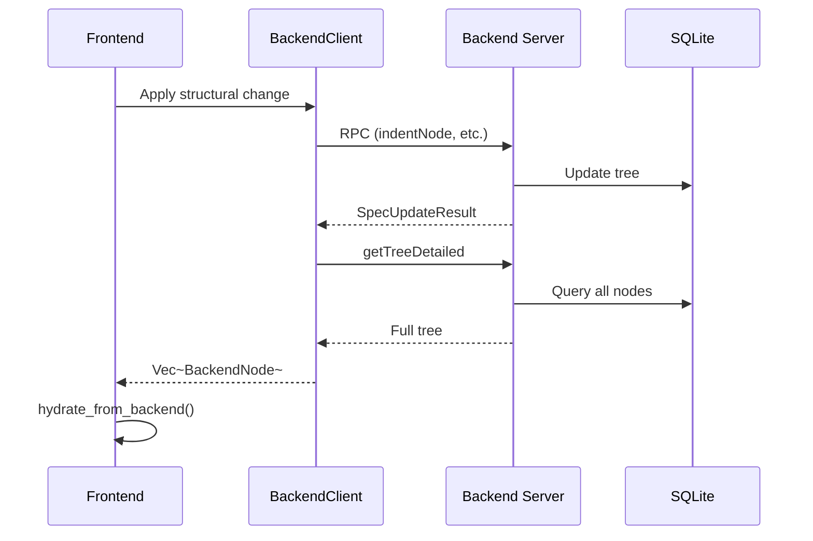

### Selection Persistence

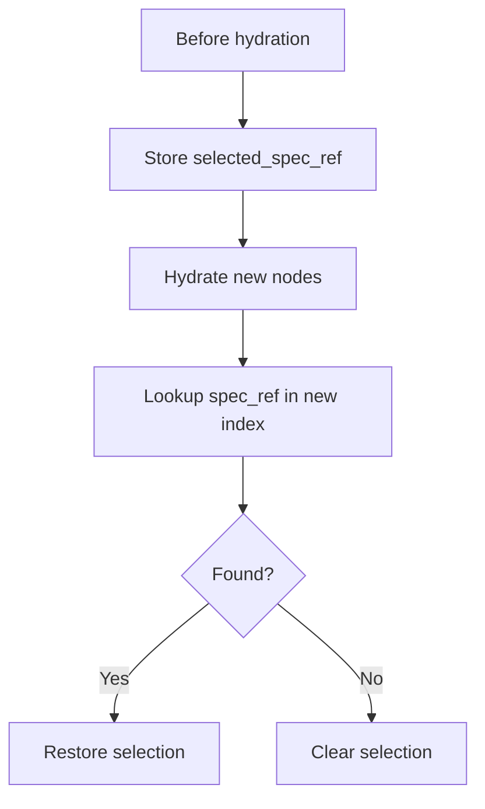

### Collapsed State

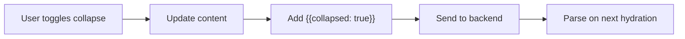

## Current Limitations
{{status: done}}

### Known Gaps

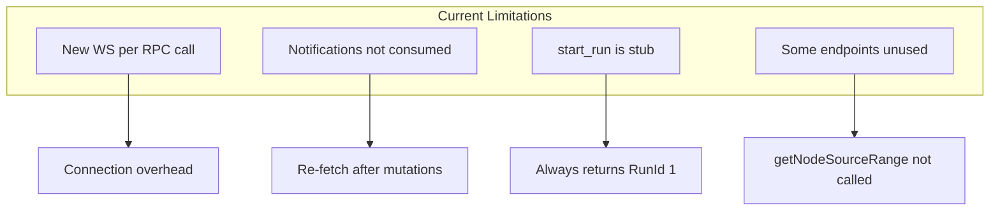

### Notification Handling Gap

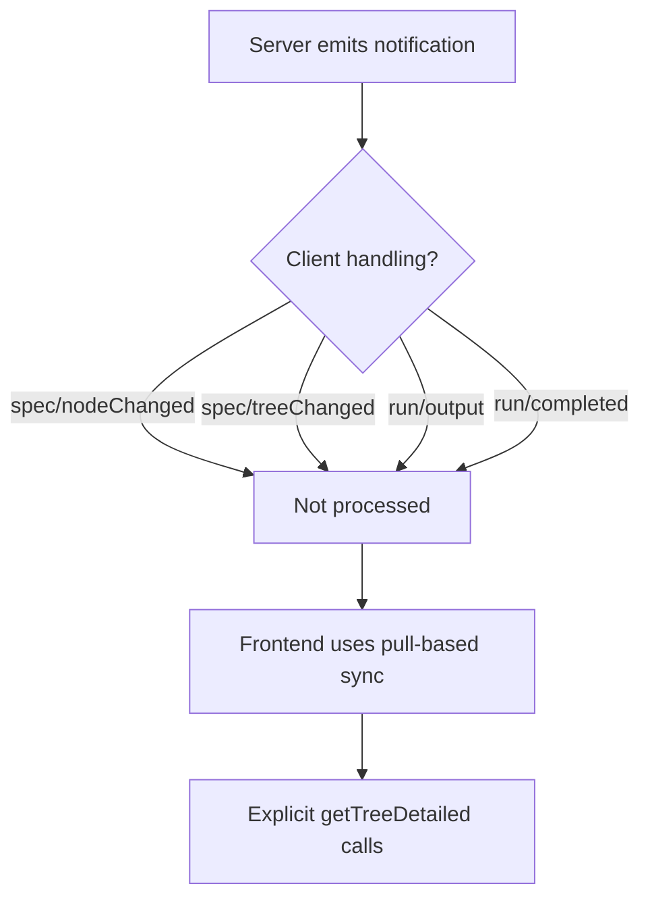
