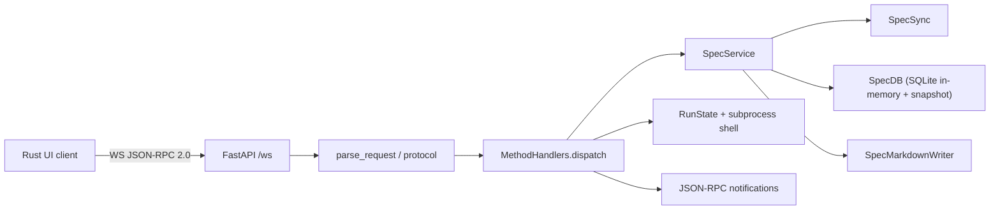
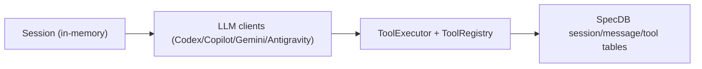

# Taui Python Backend Specification (LLM -> Server -> DB -> JSON-RPC)

{{status: draft}}

## 1. Purpose and scope

This document specifies the Python backend in this repository, including:

- LLM provider layer and auth/token lifecycle.
- FastAPI WebSocket JSON-RPC server.
- Spec indexing, persistence, and markdown writeback.
- Run execution subsystem.
- Session/tool execution model and DB schema for agent workflows.

It documents the **current implemented behavior** and explicitly marks **integration gaps** where the DB/LLM layer exists but is not yet wired into server RPC methods.

## 2. High-level architecture

### 2.1 Current runtime path (implemented)



### 2.2 Agent/LLM path (partially implemented, not wired to RPC)



The LLM/tool/session modules and DB tables exist, but the current JSON-RPC server does not expose agent methods that call them.

## 3. Python module tree and responsibilities

## 3.1 Server and protocol

- `taui/server/protocol.py`
  - JSON-RPC parse/validation and message shaping.
  - Error codes: `-32700`, `-32600`, `-32601`, `-32602`, `-32603`, custom `-32001`.
- `taui/server/app.py`
  - FastAPI app, `/healthz`, `/ws` endpoint.
  - Single active websocket client enforced.
  - Request loop: parse -> dispatch -> result -> notifications.
- `taui/server/handlers.py`
  - RPC method dispatch and handlers.
  - Spec operations, code-ref resolution, run start/stop/status.
  - Notification emission.
- `taui/server/state.py`
  - `RunState` and `RunProcess` dataclasses.

## 3.2 Spec domain and persistence

- `taui/specs/service.py`
  - Main application service for tree/node mutations.
- `taui/specs/sync.py`
  - Full markdown sync/indexing into DB.
- `taui/specs/db.py`
  - SQLite schema and async DB API.
  - In-memory runtime DB with periodic disk snapshots.
- `taui/specs/writer.py`
  - Debounced markdown regeneration/writeback.
- `taui/specs/markdown.py`
  - Heading, slug, intent/status/link parsing utilities.
- `taui/specs/models.py`
  - DTOs: `SpecNode`, `SpecNodeDetail`, `SpecUpdateResult`, `SpecNodePatch`.

## 3.3 LLM, auth, and agent tooling

- `taui/llms/base.py`
  - Shared HTTP streaming, retry, and error handling.
- `taui/llms/*.py`
  - Provider clients: `codex`, `copilot`, `gemini`, `antigravity`.
- `taui/auth/*.py`
  - OAuth/device-flow credential acquisition and token refresh.
- `taui/agent/session.py`
  - In-memory conversational session and token-budget compaction.
- `taui/tools/*`
  - Tool abstraction, registry, policy-driven execution, built-in tools.

## 4. Server transport and lifecycle

### 4.1 Process entrypoints

- `python -m taui.server serve --workspace <path> [--path <specs_path>]`
  - Binds a free localhost port and prints `PORT:<port>` once server is started.
- `taui` (project script) defaults to `serve` mode from `taui.__main__`.
- `taui reinit-db --workspace <path>`
  - Recreates workspace cache DB snapshot.

### 4.2 FastAPI endpoints

- `GET /healthz` -> `{"status": "ok"}`.
- `WS /ws` -> JSON-RPC 2.0 text frames.

### 4.3 Connection policy

- Exactly one active websocket client is allowed.
- Additional clients are accepted then closed with code `1013` and reason `single client only`.

### 4.4 App startup/shutdown behavior

On startup:

1. Create `MethodHandlers`.
2. Call `SpecService.ensure_initialized()`:
   - connect DB,
   - full markdown sync.

On shutdown:

1. Flush pending markdown writes.
2. Close DB (including snapshot flush).

## 5. JSON-RPC protocol contract

## 5.1 Request envelope

```json
{
  "jsonrpc": "2.0",
  "id": 1,
  "method": "spec/getTree",
  "params": {}
}
```

Validation rules:

- Top-level JSON must be an object.
- `jsonrpc` must equal `"2.0"`.
- `method` must be non-empty string.
- `params` must be object when present (`null` is normalized to `{}`).
- `id` may be absent (notification) or `int|string`.

## 5.2 Response envelopes

Success:

```json
{"jsonrpc":"2.0","id":1,"result":{}}
```

Error:

```json
{"jsonrpc":"2.0","id":1,"error":{"code":-32602,"message":"Invalid params"}}
```

Notification:

```json
{"jsonrpc":"2.0","method":"spec/nodeChanged","params":{...}}
```

## 5.3 Error codes

- `-32700` Parse error.
- `-32600` Invalid request.
- `-32601` Method not found.
- `-32602` Invalid params.
- `-32603` Internal error (declared, currently not explicitly emitted by handler layer).
- `-32001` Spec service error with `error.data.code` containing domain code.

## 5.4 Notification semantics

- If incoming frame has no `id`, it is treated as notification.
- Handler errors for notifications are logged and **no error response is sent**.
- For regular requests, server sends one result/error frame, then any queued notifications.
- Async run output notifications may be sent independently while request loop is active.

## 6. RPC methods (implemented)

## 6.1 Method matrix

| Method | Params | Result | Notifications | Side effects |
|---|---|---|---|---|
| `initialize` | `workspace?: string` | protocol/capabilities object | none | none |
| `shutdown` | any object | `{ "ok": true }` | none | none |
| `exit` | any object | `null` | none | none |
| `spec/getTree` | `{}` | `{ nodes: SpecNode[] }` | none | none |
| `spec/getTreeDetailed` | `{}` | `{ nodes: (SpecNodeDetail or SpecNode)[] }` | none | none |
| `spec/getNode` | `{ spec_ref: string }` | `{ node: SpecNodeDetail }` | none | none |
| `spec/updateNode` | `{ spec_ref, patch }` | `SpecUpdateResult` | `spec/nodeChanged`, optional `spec/treeChanged` | updates DB + writeback |
| `spec/createSiblingNode` | `{ spec_ref }` | `SpecUpdateResult` | `spec/treeChanged`, `spec/nodeChanged` | structural mutation + writeback |
| `spec/indentNode` | `{ spec_ref }` | `SpecUpdateResult` | `spec/treeChanged`, `spec/nodeChanged` | structural mutation + writeback |
| `spec/outdentNode` | `{ spec_ref }` | `SpecUpdateResult` | `spec/treeChanged`, `spec/nodeChanged` | structural mutation + writeback |
| `spec/getNodeSourceRange` | `{ spec_ref, expanded?, max_lines? }` | source snippet payload | none | file read only |
| `spec/getNodeCodeRefs` | `{ spec_ref, max_lines? }` | `{ refs: CodeRefPreview[] }` | none | file read only |
| `run/start` | `{ spec_ref, command, workdir? }` | `RunProcess` | async `run/output`, `run/completed` | spawn subprocess |
| `run/stop` | `{}` | `RunState` | `run/completed` when applicable | terminate subprocess |
| `run/status` | `{}` | `RunState` | none | none |

## 6.2 Initialize result

`initialize` returns:

- `protocolVersion: "1.0"`
- `serverName: "taui-python-server"`
- `workspace: string|null`
- `capabilities.methods`: current method list.
- `capabilities.notifications`:
  - `spec/nodeChanged`, `spec/treeChanged`
  - `agent/event`, `agent/token`, `approval/request`, `clarificationRequired`, `amendmentProposed`
  - `run/output`, `run/completed`

Note: the `agent/*` and clarification notifications are advertised but not emitted by current handlers.

## 6.3 Spec update patch rules

`patch` object supports only keys: `title`, `intent`, `content`.

- Unknown keys -> invalid params.
- Values must be `string` or `null`.
- At least one field required.
- `intent` and `content` cannot be set in the same patch.
- Empty/blank `title` is rejected.

Behavior:

- `title` change updates anchor slug and `spec_ref`.
- Rename triggers in-file markdown anchor rewrite for local links.
- `intent` patch edits first intent-like line in content region.
- `status` is re-derived from `{{status: ...}}` marker in early content lines.

## 6.4 Source range and code-ref preview behavior

`spec/getNodeSourceRange`:

- Resolves node file relative to workspace.
- Rejects path escape.
- Returns bounded preview (`max_lines`, default 10) unless `expanded=true`.
- On missing file/read failure returns payload with `error` string and empty content.

`spec/getNodeCodeRefs`:

- Scans node content for `{{code_ref: `...`}}` or `{{code\_ref: `...`}}`.
- Supports line references `#Lx` and `#Lx-Ly`.
- Resolves relative paths against spec file parent and workspace.
- Enforces workspace containment.
- Returns per-ref preview with truncation flag and optional error (`invalid line range`, `file not found`, `path escapes workspace`, etc.).

## 6.5 Run subsystem behavior

`run/start`:

- Validates `spec_ref` and `command` as non-empty strings.
- `workdir` defaults to `"."`, resolves under workspace, must be existing directory.
- Starts async subprocess shell.
- Stores active process in `RunState` with incrementing `run_id`.

Runtime notifications:

- `run/output`: one per line from stdout/stderr.
- `run/completed`: final status and exit code.

`run/stop`:

- Terminates process (`terminate`, then `kill` after 5s timeout).
- Marks run `stopped`.
- Emits `run/completed` notification.

`run/status` returns minimal state:

- `status`: `idle|running`
- `run_id`
- `spec_ref`

Current limitation:

- `duration_ms` is computed as `int(seconds) * 1000`, giving second-level granularity.

## 7. Spec data model

## 7.1 Core DTOs

`SpecNode`:

- `id`, `spec_ref`, `title`, `depth`, `file_path`, `anchor`, `intent?`, `status?`

`SpecNodeDetail` extends `SpecNode`:

- `content`, `line_start?`, `line_end?`

`SpecUpdateResult`:

- `previous_spec_ref`, `node` (`SpecNodeDetail`), `tree_changed`

`SpecNodePatch`:

- `title?`, `intent?`, `content?` with `UNSET` sentinel semantics.

## 7.2 Markdown interpretation rules

- Heading lines (`#`, `##`, ...) create heading nodes.
- Files with no headings are parsed as single plain-document node:
  - first non-empty non-link line as title,
  - following non-heading/list/link paragraph as intent.
- Anchor slug uses ASCII alnum lowercasing with dash compaction; empty slug -> `untitled`.
- `{{status: ...}}` scanned in first 8 lines of section.
- Generic metadata `{{key: value}}` scanned in first 12 lines of section.

## 8. Sync, tree building, and writeback

## 8.1 Full sync algorithm (`SpecSync.full_sync`)

1. Enumerate `*.md` under spec root.
2. Upsert `files` entries with hash and mtime.
3. Parse nodes per file and replace file-scoped nodes.
4. Remove DB file records no longer present.
5. Build graph edges:
   - heading parentage edges,
   - cross-file markdown link edges.
6. Build `node_refs` from cross-file links.
7. Extract and replace metadata table.
8. Recompute and store `(depth, sort_order)` coordinates.

Traversal for coordinates:

- Start at `<spec_root>/_main.md` if present.
- Follow first appearance of linked markdown children, depth-first.
- Visit unvisited files lexicographically afterwards.

## 8.2 Writeback algorithm (`SpecMarkdownWriter`)

- Writeback is debounced per-file (`500ms` default).
- Node rendering:
  - heading nodes rendered as `#`-prefixed heading,
  - plain nodes render title line without heading markers.
- Injects `{{status: ...}}` if status exists and section lacks one.
- Writes normalized trailing newline.
- Updates file hash/mtime tracking in `files` table.

## 9. SQLite schema and persistence model

## 9.1 Runtime/storage strategy

- Runtime DB is in-memory (`:memory:`).
- Snapshot loaded from disk on connect if present.
- Snapshot flushed every `30 sec` and on close.
- Disk path: `platformdirs.user_cache_dir("taui")/<workspace_sha12>/spec.db`.

## 9.2 Tables

Spec indexing tables:

- `files` (`rel_path`, `content_hash`, `last_seen`, `mtime_ns`)
- `nodes` (`spec_ref`, `anchor`, hierarchy/location/content/status fields)
- `edges` (generic parent-child graph with `sort_order`)
- `node_refs` (cross-node references)
- `node_metadata` (`key/value` metadata per node)

Agent/session tables (present in schema):

- `sessions` (session lineage, provider/model, status)
- `messages` (ordered chat messages + token/cost fields)
- `tool_calls`
- `tool_results`
- `questions`
- `subagent_spawns`

## 9.3 Foreign key and delete behavior

- `nodes.file_id` -> `files.id` cascade delete.
- `edges` parent/child -> `nodes.id` cascade delete.
- `node_refs` from/to -> `nodes.id` cascade delete.
- `sessions.node_id` -> `nodes.id` set null on delete.
- `messages.session_id` -> `sessions.id` cascade delete.
- `tool_calls.message_id` -> `messages.id` cascade delete.
- `tool_results.tool_call_id` -> `tool_calls.id` cascade delete.
- `questions.session_id` -> `sessions.id` cascade delete.

## 10. LLM provider layer

## 10.1 Common contract (`BaseLLMClient`)

Inputs:

- `messages: list[dict]`
- `model: str`
- `temperature`

Outputs:

- `stream_chat(...) -> str` (stream text to stdout, return full text)
- `create_turn(...) -> ProviderTurnResult`

Resilience behavior:

- Retry up to 3 times on retryable statuses/network errors.
- Do not retry auth failures (`401`).
- Detect context overflow and quota errors; fail fast with friendly messages.
- Retry delay precedence:
  - `retry-after`,
  - `x-ratelimit-reset`,
  - `x-ratelimit-reset-after`,
  - retry hints in body,
  - exponential backoff.

## 10.2 Provider matrix

| Provider | Client | API mode | Tools | Notes |
|---|---|---|---|---|
| Codex | `CodexLLMClient` | OpenAI Responses SSE | yes (`responses`) | Parses `response.output_text.delta`, function call items, completed payload |
| Copilot | `CopilotLLMClient` | OpenAI Chat Completions | yes (`chat`) | Non-stream `create_turn`, supports fallback model without vendor prefix |
| Gemini | `GeminiLLMClient` | Cloud Code Assist SSE | no | Maps assistant role to `model`, skips `thought` parts |
| Antigravity | `AntigravityLLMClient` | Gemini-compatible SSE sandbox | no | Prepends fixed system instruction, custom headers/UA |

## 10.3 LLM message/type model

`taui/llm/types.py` defines typed layer:

- `Message(role, content, tool_calls?, tool_call_id?, name?)`
- `ToolCall(id, name, arguments)`
- `Usage(input_tokens, output_tokens, cost_usd?)`
- `StreamEvent(type, delta?, tool_call?, usage?)`

## 11. Auth and credential lifecycle

## 11.1 Storage

Provider config is saved in `~/.config/taui/config.toml` under `[providers.<name>]`.

## 11.2 Provider auth flows

- Codex (`auth/codex.py`)
  - OAuth PKCE browser redirect (`localhost:1455/auth/callback`).
  - Stores `refresh_token` and `account_id`.
- Gemini (`auth/gemini.py`)
  - OAuth PKCE browser redirect (`localhost:8085/oauth2callback`).
  - Discovers/creates Cloud Code Assist project.
  - Stores `refresh_token`, `project_id`, optional email.
- Antigravity (`auth/antigravity.py`)
  - OAuth PKCE browser redirect (`localhost:51121/oauth-callback`).
  - Simpler project discovery with fallback default project id.
- Copilot (`auth/copilot.py`)
  - GitHub device flow, then Copilot token exchange.
  - Stores long-lived GitHub token (`api_key`); Copilot token refreshed as needed.

## 12. Session and tool execution model

## 12.1 Session behavior (`agent/session.py`)

- Tracks message list, usage totals, read-attempt map, timestamps.
- Token-budget compaction:
  - preserves latest system + latest user,
  - preserves unresolved tool-call chains,
  - drops oldest droppable messages,
  - injects summary system message when trimming occurs.

## 12.2 Tool execution (`tools/executor.py`)

- Inputs: `tool_call_id`, `tool_name`, `arguments`, `ToolContext`, optional approval.
- Policy decisions:
  - `allow` -> execute,
  - `confirm` -> require explicit approval,
  - `deny` -> fail immediately.
- Basic schema validation: object type, required fields, primitive type checks.
- Enforces timeout (policy default or request override).
- Returns typed outcomes:
  - `completed`,
  - `approval_required`,
  - `denied`.

## 12.3 Built-in tools

- `read`: UTF-8 file read with numbered lines.
- `edit`: exact string replacement; requires prior successful read.
- `write`: full file write; requires prior read and explicit missing-file flow.
- `bash`: subprocess shell with workdir restrictions, timeout, output truncation.
- `glob`: file glob search.
- `grep`: regex search across workspace files.

Security baseline for built-ins:

- Paths resolved and constrained to workspace.
- Bash workdir constrained to workspace when policy flag is enabled.
- Environment filtered by allowlist.

## 13. Current integration gaps (important)

The following are implemented pieces that are not yet connected end-to-end through server RPC:

1. LLM turn execution is not exposed in `MethodHandlers.dispatch`.
2. Session/message/tool persistence tables are not written by server handlers.
3. Advertised notifications `agent/event`, `agent/token`, `approval/request`, `clarificationRequired`, `amendmentProposed` are not emitted by current handlers.
4. `drain_notifications()` is a no-op.

Practical result:

- Current production RPC behavior is focused on spec tree editing and shell run execution.
- LLM + tool orchestration currently exists as library components, not as active server workflow.

## 14. Proposed RPC extension contract for full LLM -> DB -> UI path

Recommended additions to close the gap:

- `agent/startSession` -> create `sessions` row.
- `agent/sendTurn` -> persist user message, run LLM turn, stream token notifications, persist assistant/tool events.
- `agent/approveTool` -> continue blocked tool execution.
- `agent/answerQuestion` -> persist clarification response and resume.
- `agent/getSession` -> replay conversation + usage stats from DB.

Recommended notifications:

- `agent/token` for incremental assistant text.
- `agent/event` for lifecycle (turn_started, tool_called, tool_completed, turn_completed).
- `approval/request` when `ExecutionRequiresApproval` occurs.
- `clarificationRequired` for unresolved blocking questions.
- `amendmentProposed` when implementation diverges from spec and requires explicit approval.

## 15. Non-functional requirements

- Deterministic behavior:
  - stable sort/depth recomputation from `_main.md` traversal + file order fallback.
- Safety:
  - workspace path containment checks for file previews and run workdirs.
- Persistence:
  - periodic snapshot of in-memory DB to reduce startup reparse cost.
- Observability:
  - structured logging in all major flows (startup, dispatch, sync, run, LLM retries).
- Test baseline:
  - protocol parsing, websocket round-trip, core spec mutations, and startup port signaling are covered.

## 16. Known discrepancies to resolve

1. `test_update_content_rejects_non_leaf_section` currently fails against `SpecService.update_node` behavior in this branch.
2. Some UI-side backend client methods currently deserialize structural edit responses as `TreeNode`, while server returns `SpecUpdateResult`.
3. Run duration reporting is second-granularity due integer truncation before `*1000`.

These should be treated as correctness issues to align implementation with intended contract.
