# State Management
{{status: done}}

This document covers the state management patterns used in Taui, focusing on the frontend Rust implementation and its synchronization with the backend.

## Frontend State Architecture
{{status: done}}

### State Hierarchy

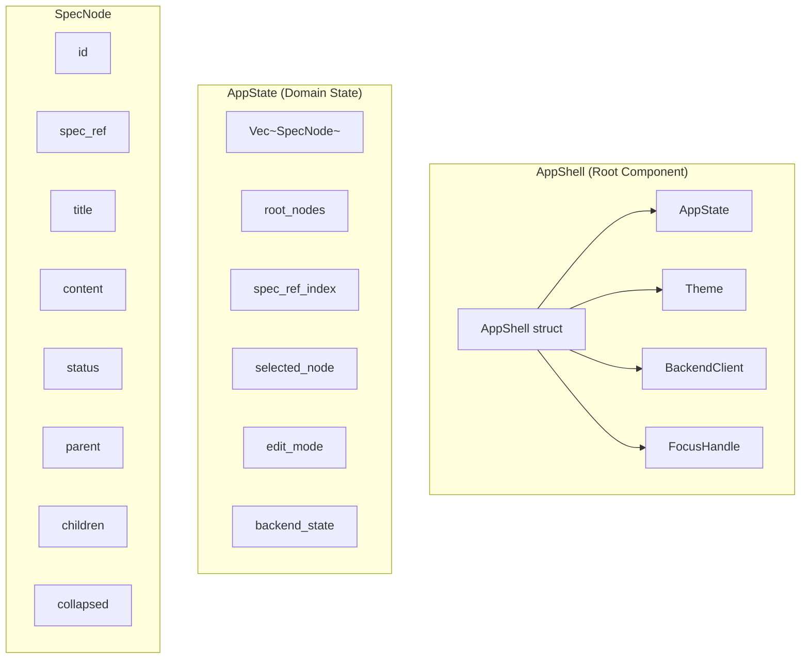
```mermaid
graph TB
    subgraph AppShell["AppShell (Root Component)"]
        AS[AppShell struct]
        AS --> ST[AppState]
        AS --> TH[Theme]
        AS --> BC[BackendClient]
        AS --> FH[FocusHandle]
    end
    
    subgraph AppState["AppState (Domain State)"]
        NS[Vec~SpecNode~]
        RN[root_nodes]
        SI[spec_ref_index]
        SN[selected_node]
        EM[edit_mode]
        BS[backend_state]
    end
    
    subgraph SpecNode["SpecNode"]
        ID[id]
        SR[spec_ref]
        TI[title]
        CO[content]
        ST2[status]
        PA[parent]
        CH[children]
        CL[collapsed]
    end
```

### Pure Reducer Pattern

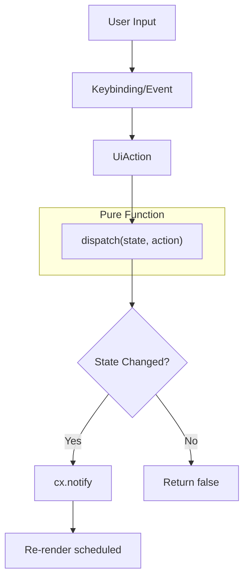
```mermaid
flowchart TD
    A[User Input] --> B[Keybinding/Event]
    B --> C[UiAction]
    C --> D["dispatch(state, action)"]
    D --> E{State Changed?}
    E -->|Yes| F[cx.notify]
    E -->|No| G[Return false]
    F --> H[Re-render scheduled]
    
    subgraph PureFunction["Pure Function"]
        D
    end
```

## Action Dispatch System
{{status: done}}

### UiAction Types

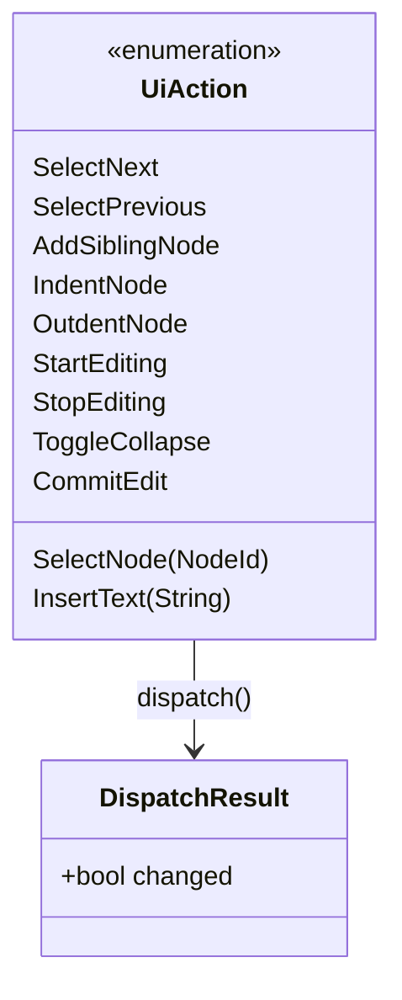
```mermaid
classDiagram
    class UiAction {
        <<enumeration>>
        SelectNode(NodeId)
        SelectNext
        SelectPrevious
        AddSiblingNode
        IndentNode
        OutdentNode
        StartEditing
        StopEditing
        InsertText(String)
        ToggleCollapse
        CommitEdit
    }
    
    class DispatchResult {
        +bool changed
    }
    
    UiAction --> DispatchResult : dispatch()
```

### Dispatch Flow

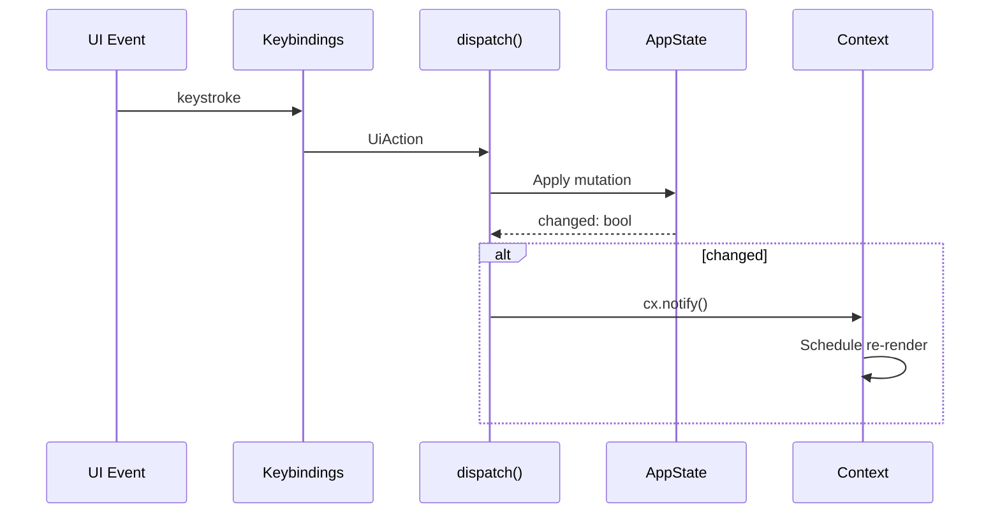
```mermaid
sequenceDiagram
    participant UI as UI Event
    participant KB as Keybindings
    participant D as dispatch()
    participant S as AppState
    participant CX as Context
    
    UI->>KB: keystroke
    KB->>D: UiAction
    D->>S: Apply mutation
    S-->>D: changed: bool
    alt changed
        D->>CX: cx.notify()
        CX->>CX: Schedule re-render
    end
```

### Action Categories

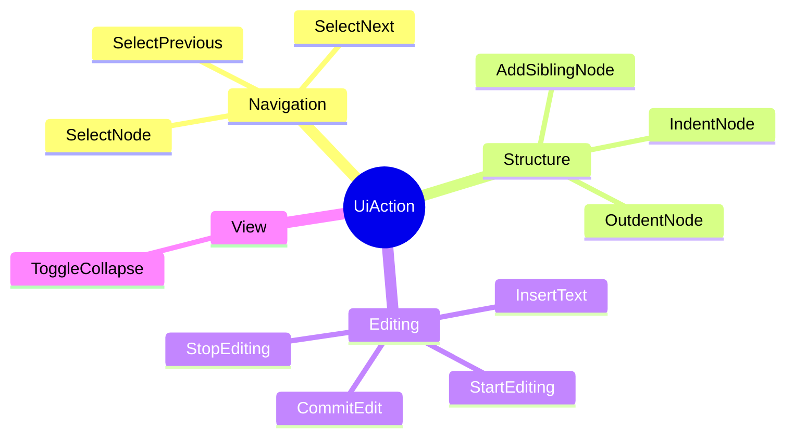
```mermaid
mindmap
  root((UiAction))
    Navigation
      SelectNode
      SelectNext
      SelectPrevious
    Structure
      AddSiblingNode
      IndentNode
      OutdentNode
    Editing
      StartEditing
      StopEditing
      InsertText
      CommitEdit
    View
      ToggleCollapse
```

## Tree Operations
{{status: done}}

### Tree Flattening

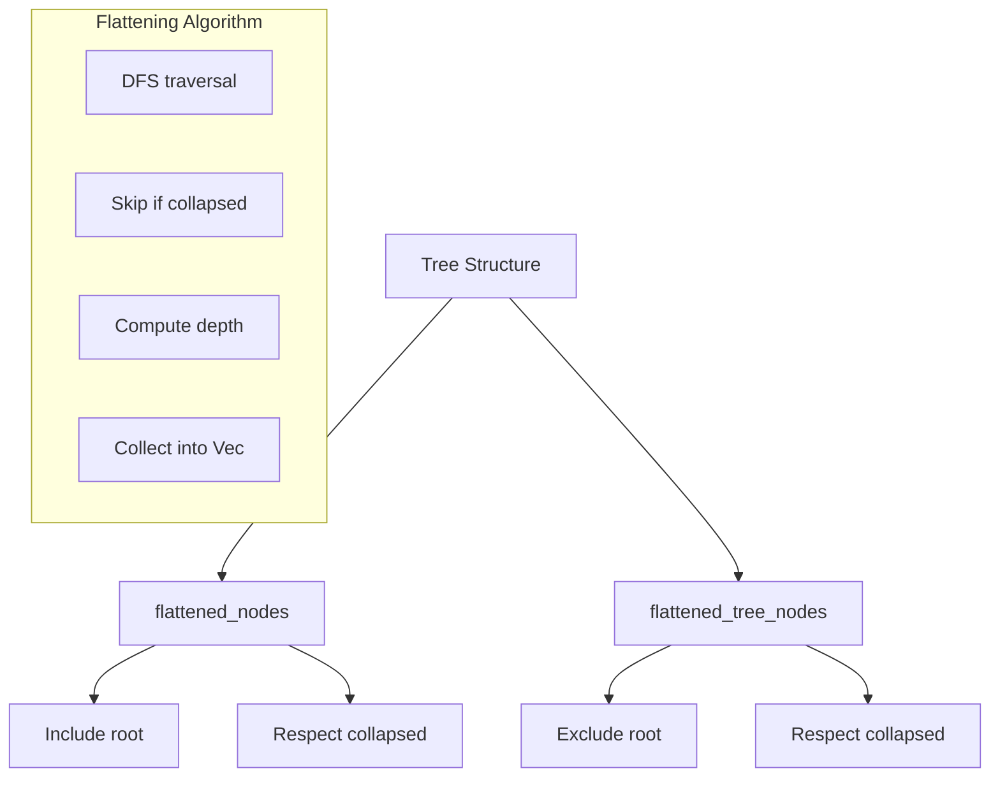
```mermaid
flowchart TD
    A[Tree Structure] --> B[flattened_nodes]
    A --> C[flattened_tree_nodes]
    
    B --> D[Include root]
    B --> E[Respect collapsed]
    
    C --> F[Exclude root]
    C --> G[Respect collapsed]
    
    subgraph Algorithm["Flattening Algorithm"]
        H[DFS traversal]
        I[Skip if collapsed]
        J[Compute depth]
        K[Collect into Vec]
    end
```

### Indent Operation

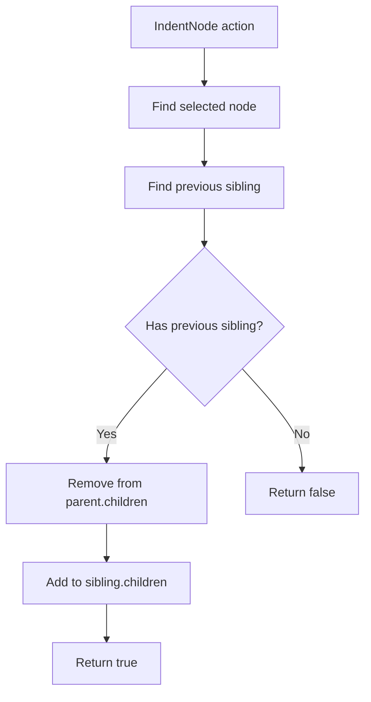
```mermaid
flowchart TD
    A[IndentNode action] --> B[Find selected node]
    B --> C[Find previous sibling]
    C --> D{Has previous sibling?}
    D -->|Yes| E[Remove from parent.children]
    E --> F[Add to sibling.children]
    F --> G[Return true]
    D -->|No| H[Return false]
```

### Outdent Operation

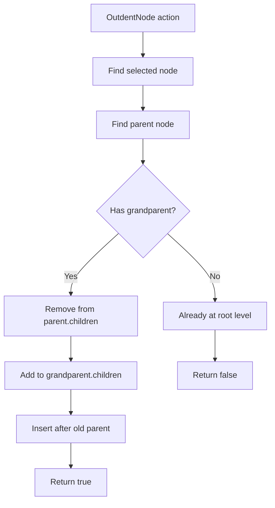
```mermaid
flowchart TD
    A[OutdentNode action] --> B[Find selected node]
    B --> C[Find parent node]
    C --> D{Has grandparent?}
    D -->|Yes| E[Remove from parent.children]
    E --> F[Add to grandparent.children]
    F --> G[Insert after old parent]
    G --> H[Return true]
    D -->|No| I[Already at root level]
    I --> J[Return false]
```

### Add Sibling Operation

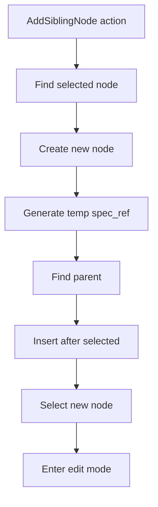
```mermaid
flowchart TD
    A[AddSiblingNode action] --> B[Find selected node]
    B --> C[Create new node]
    C --> D[Generate temp spec_ref]
    D --> E[Find parent]
    E --> F[Insert after selected]
    F --> G[Select new node]
    G --> H[Enter edit mode]
```

## Selection Management
{{status: done}}

### Selection Persistence

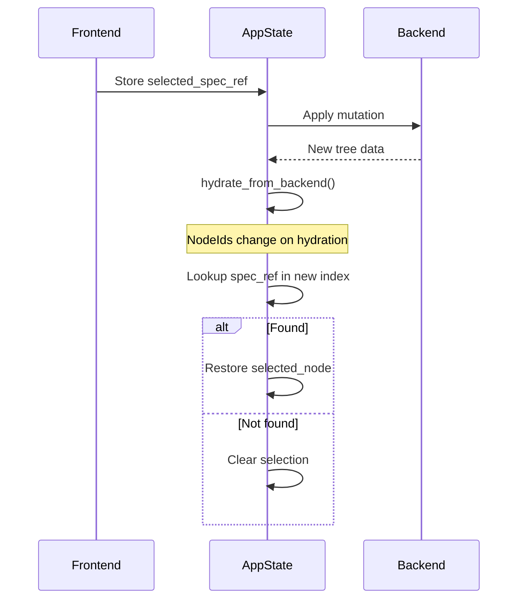
```mermaid
sequenceDiagram
    participant UI as Frontend
    participant S as AppState
    participant BC as Backend
    
    UI->>S: Store selected_spec_ref
    S->>BC: Apply mutation
    BC-->>S: New tree data
    S->>S: hydrate_from_backend()
    Note over S: NodeIds change on hydration
    S->>S: Lookup spec_ref in new index
    alt Found
        S->>S: Restore selected_node
    else Not found
        S->>S: Clear selection
    end
```

### Selection Navigation

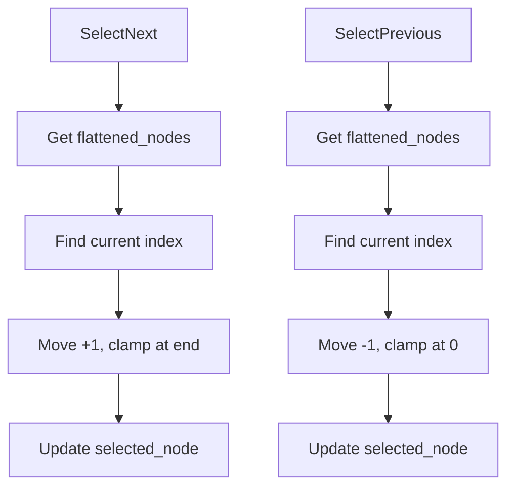
```mermaid
flowchart TD
    A[SelectNext] --> B[Get flattened_nodes]
    B --> C[Find current index]
    C --> D[Move +1, clamp at end]
    D --> E[Update selected_node]
    
    F[SelectPrevious] --> G[Get flattened_nodes]
    G --> H[Find current index]
    H --> I[Move -1, clamp at 0]
    I --> J[Update selected_node]
```

## Edit State
{{status: done}}

### Edit Mode Lifecycle

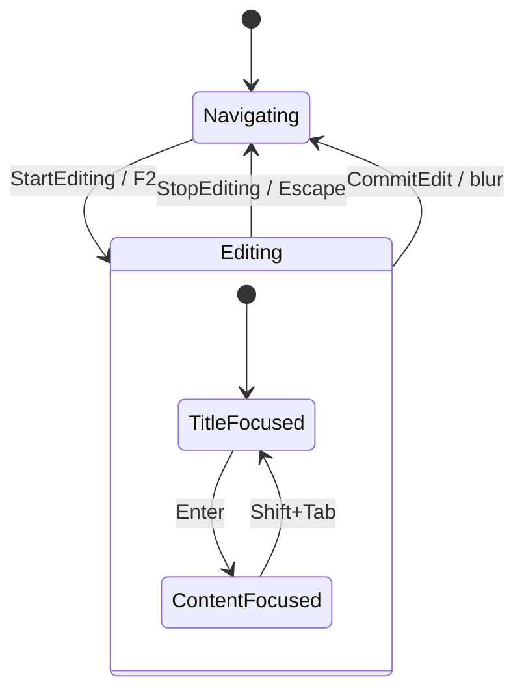
```mermaid
stateDiagram-v2
    [*] --> Navigating
    Navigating --> Editing: StartEditing / F2
    Editing --> Navigating: StopEditing / Escape
    Editing --> Navigating: CommitEdit / blur
    
    state Editing {
        [*] --> TitleFocused
        TitleFocused --> ContentFocused: Enter
        ContentFocused --> TitleFocused: Shift+Tab
    }
```

### Auto-Save Pattern

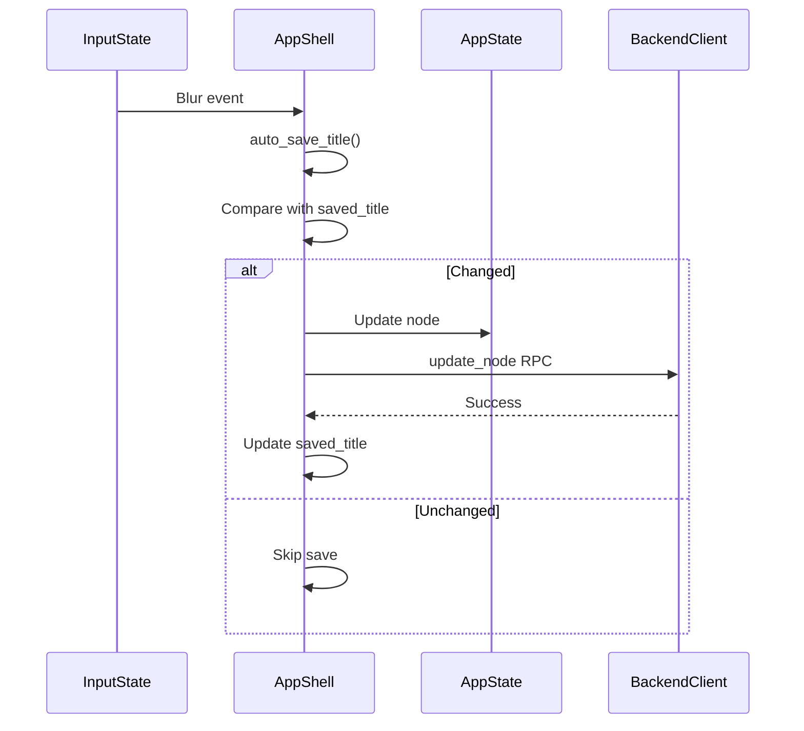
```mermaid
sequenceDiagram
    participant Input as InputState
    participant Shell as AppShell
    participant State as AppState
    participant BC as BackendClient
    
    Input->>Shell: Blur event
    Shell->>Shell: auto_save_title()
    Shell->>Shell: Compare with saved_title
    alt Changed
        Shell->>State: Update node
        Shell->>BC: update_node RPC
        BC-->>Shell: Success
        Shell->>Shell: Update saved_title
    else Unchanged
        Shell->>Shell: Skip save
    end
```

## Hydration
{{status: done}}

### Hydration Flow

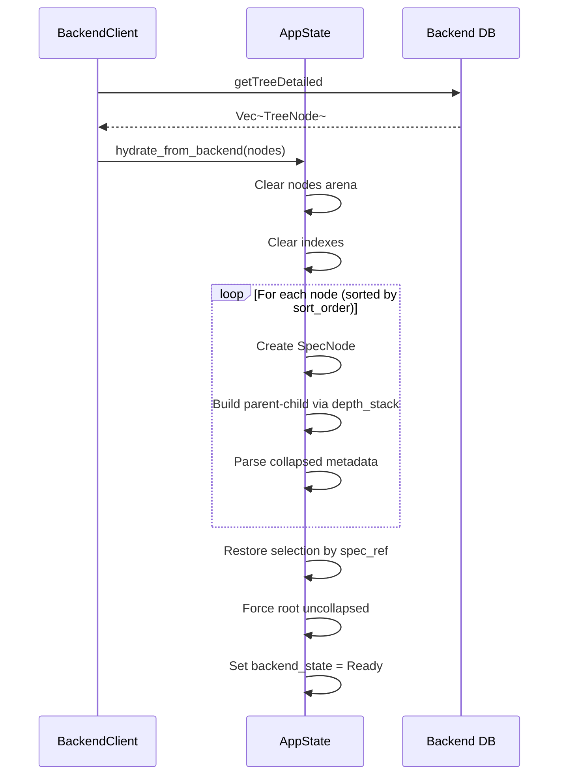
```mermaid
sequenceDiagram
    participant BC as BackendClient
    participant S as AppState
    participant DB as Backend DB
    
    BC->>DB: getTreeDetailed
    DB-->>BC: Vec~TreeNode~
    BC->>S: hydrate_from_backend(nodes)
    S->>S: Clear nodes arena
    S->>S: Clear indexes
    
    loop For each node (sorted by sort_order)
        S->>S: Create SpecNode
        S->>S: Build parent-child via depth_stack
        S->>S: Parse collapsed metadata
    end
    
    S->>S: Restore selection by spec_ref
    S->>S: Force root uncollapsed
    S->>S: Set backend_state = Ready
```

### Depth Stack Algorithm

```mermaid
flowchart TD
    A[Process node with depth D] --> B{D == 0?}
    B -->|Yes| C[Add to root_nodes]
    B -->|No| D[Parent = stack[D-1]]
    D --> E[Add to parent.children]
    E --> F[Set node.parent]
    C --> G[stack[D] = node]
    F --> G
    G --> H[Truncate stack to D+1]
    H --> I[Next node]
```

## Backend State
{{status: done}}

### Backend State Machine

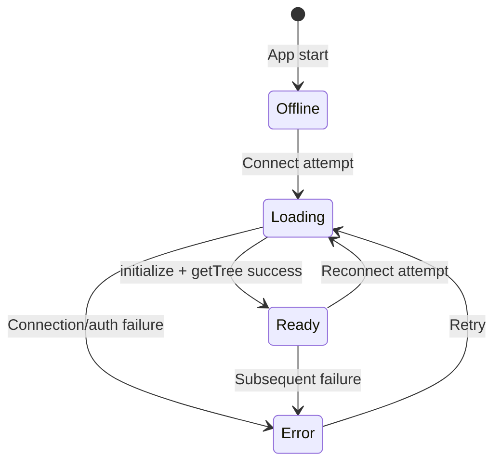
```mermaid
stateDiagram-v2
    [*] --> Offline: App start
    Offline --> Loading: Connect attempt
    Loading --> Ready: initialize + getTree success
    Loading --> Error: Connection/auth failure
    Ready --> Loading: Reconnect attempt
    Error --> Loading: Retry
    Ready --> Error: Subsequent failure
```

### State Transitions

| From | To | Trigger |
|------|-----|---------|
| Offline | Loading | Backend connection started |
| Loading | Ready | initialize + getTreeDetailed success |
| Loading | Error | Any failure |
| Ready | Loading | Reconnect after error |
| Error | Loading | Retry attempt |

## Collapsed State
{{status: done}}

### Collapse Persistence

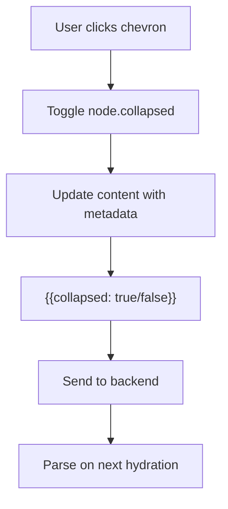
```mermaid
flowchart TD
    A[User clicks chevron] --> B[Toggle node.collapsed]
    B --> C[Update content with metadata]
    C --> D["{{collapsed: true/false}}"]
    D --> E[Send to backend]
    E --> F[Parse on next hydration]
```

### Metadata Parsing

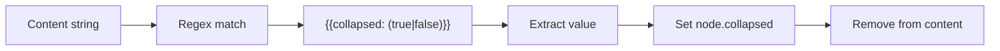
```mermaid
flowchart LR
    A[Content string] --> B[Regex match]
    B --> C["{{collapsed: (true|false)}}"]
    C --> D[Extract value]
    D --> E[Set node.collapsed]
    E --> F[Remove from content]
```

## Structural Mutations
{{status: done}}

### Optimistic-Pessimistic Hybrid

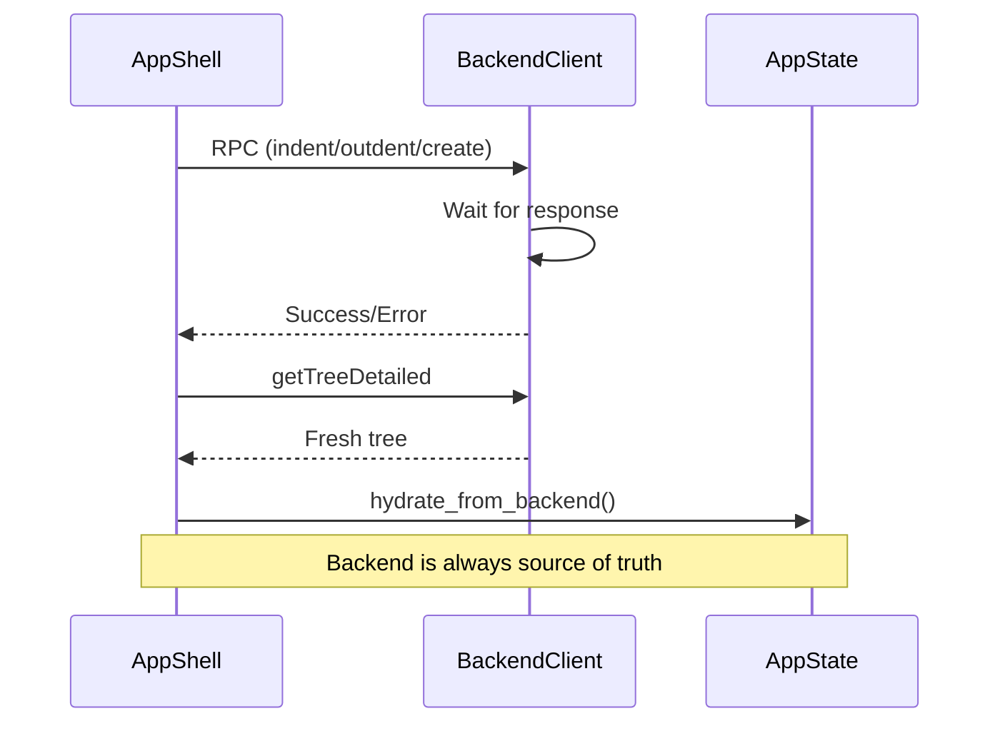
```mermaid
sequenceDiagram
    participant UI as AppShell
    participant BC as BackendClient
    participant S as AppState
    
    UI->>BC: RPC (indent/outdent/create)
    BC->>BC: Wait for response
    BC-->>UI: Success/Error
    UI->>BC: getTreeDetailed
    BC-->>UI: Fresh tree
    UI->>S: hydrate_from_backend()
    Note over UI,S: Backend is always source of truth
```

### Structural Flow

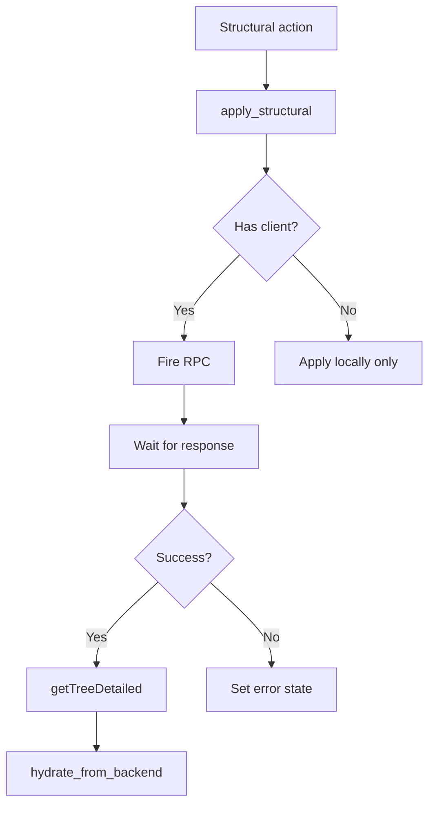
```mermaid
flowchart TD
    A[Structural action] --> B[apply_structural]
    B --> C{Has client?}
    C -->|Yes| D[Fire RPC]
    D --> E[Wait for response]
    E --> F{Success?}
    F -->|Yes| G[getTreeDetailed]
    F -->|No| H[Set error state]
    G --> I[hydrate_from_backend]
    C -->|No| J[Apply locally only]
```

## Index Management
{{status: done}}

### Spec Reference Index

```mermaid
flowchart TD
    A[Add node] --> B[spec_ref_index.insert]
    B --> C[spec_ref -> NodeId]
    
    D[Remove node] --> E[spec_ref_index.remove]
    
    F[Lookup by spec_ref] --> G[O(1) access]
```

### Index Rebuild

```mermaid
flowchart TD
    A[hydrate_from_backend] --> B[Clear spec_ref_index]
    B --> C[Loop through nodes]
    C --> D[Insert spec_ref -> NodeId]
    D --> E[Build parent-child edges]
    E --> F[Build root_nodes list]
```
