# Theme System
{{status: done}}

The theme system provides a comprehensive design token architecture for the Taui UI, including colors, typography, and semantic status colors.

## Theme Architecture
{{status: done}}

### Module Structure

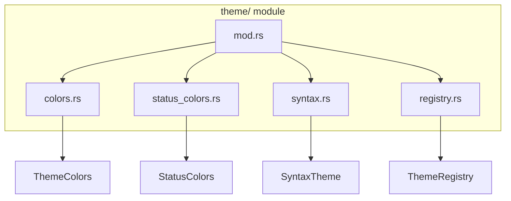

### Theme Hierarchy

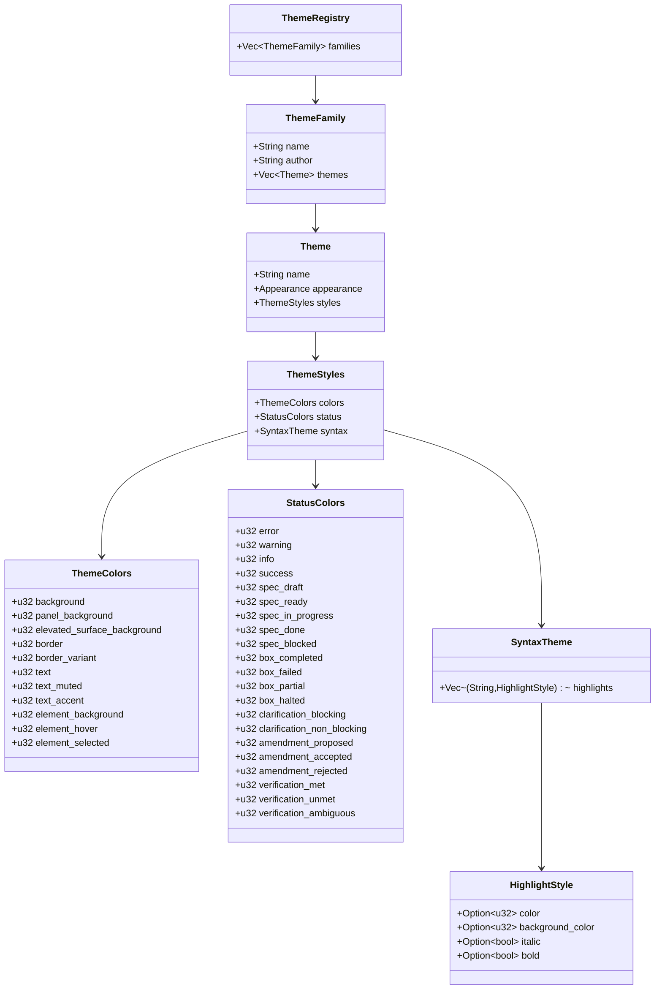

## Color System
{{status: done}}

### UI Color Tokens

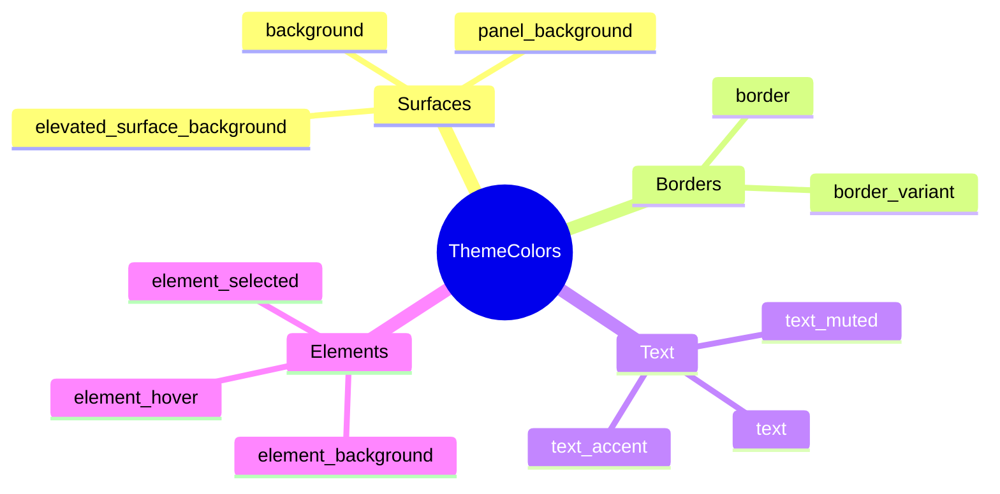

### Taui Dark Palette

| Token | Value | Description |
|-------|-------|-------------|
| background | `#0d1117` | Main background |
| panel_background | `#161b22` | Panel surfaces |
| border | `#30363d` | Primary borders |
| text | `#e6edf3` | Primary text |
| text_muted | `#7d8590` | Secondary text |
| element_selected | `#1f6feb` | Selection highlight |

### Taui Light Palette

| Token | Value | Description |
|-------|-------|-------------|
| background | `#ffffff` | Main background |
| panel_background | `#f6f8fa` | Panel surfaces |
| border | `#d0d7de` | Primary borders |
| text | `#1f2328` | Primary text |
| text_muted | `#656d76` | Secondary text |
| element_selected | `#0969da` | Selection highlight |

## Status Colors
{{status: done}}

### Semantic Color Categories

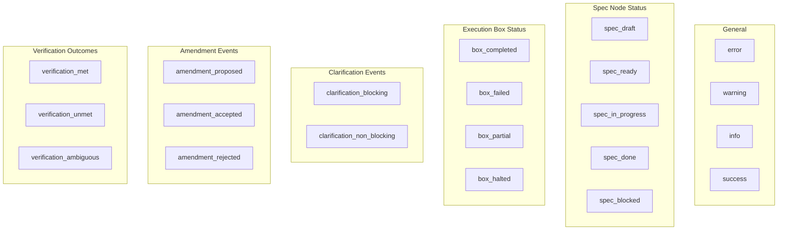

### Status Color Mapping

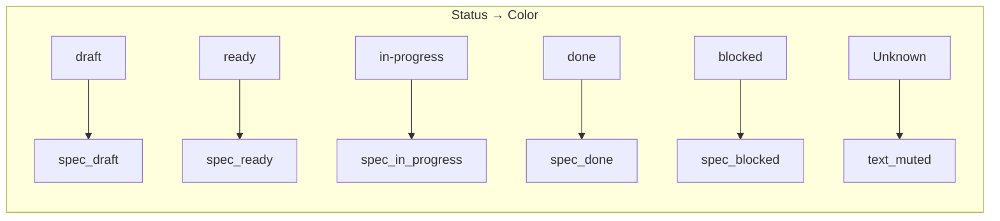

## Typography
{{status: done}}

### Heading Styles

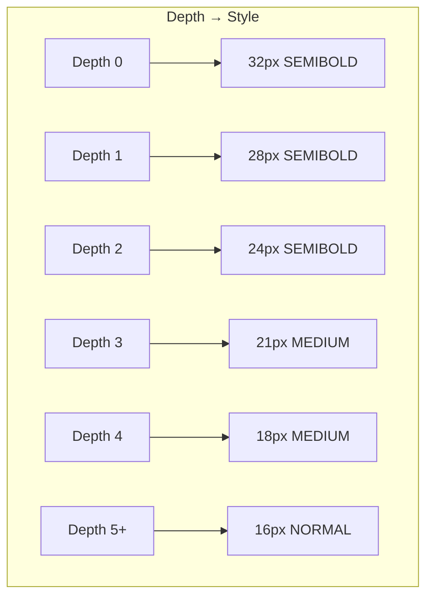

### Font Weights

| Constant | Value | Usage |
|----------|-------|-------|
| NORMAL | 400 | Body text |
| MEDIUM | 500 | Level 3-4 headings |
| SEMIBOLD | 600 | Level 0-2 headings |

### Content Style

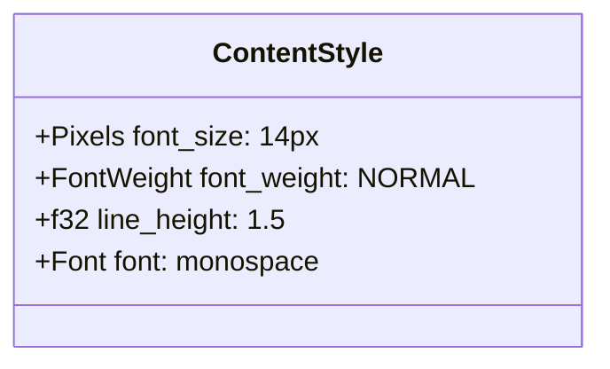

### Layout Constants

| Constant | Value | Purpose |
|----------|-------|---------|
| MAX_CONTENT_WIDTH | 960px | Document column width |
| INDENT_PER_LEVEL | 24px | Tree indent increment |

## Theme Registry
{{status: done}}

### Built-in Theme Families

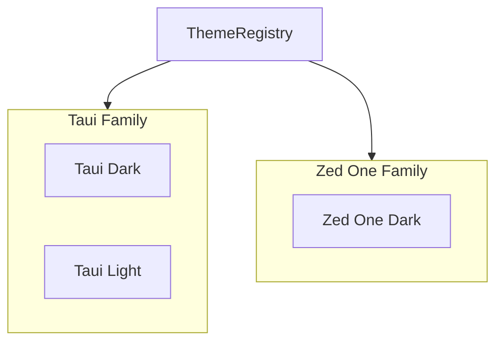

### Theme Loading

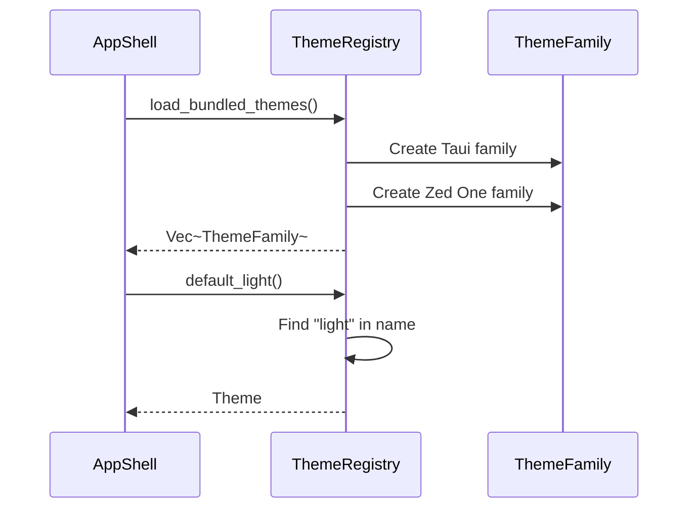

### Default Theme Selection

```mermaid
flowchart TD
    A[default_light] --> B{Theme name has "light"?}
    B -->|Yes| C[Return that theme]
    B -->|No| D[Find Appearance::Light]
    D --> E[Return first match]
    
    F[default_dark] --> G{Theme name has "dark"?}
    G -->|Yes| H[Return that theme]
    G -->|No| I[Find Appearance::Dark]
    I --> J[Return first match]
```

## Theme Refinement
{{status: done}}

### Refinement Pattern

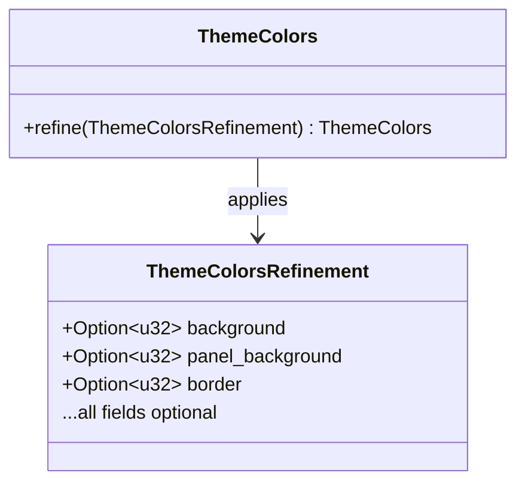

### Refinement Flow

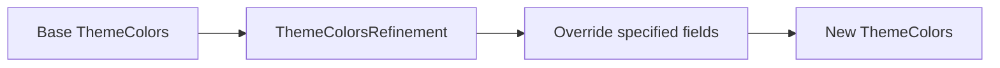

## Usage in Components
{{status: done}}

### Current Implementation Gap

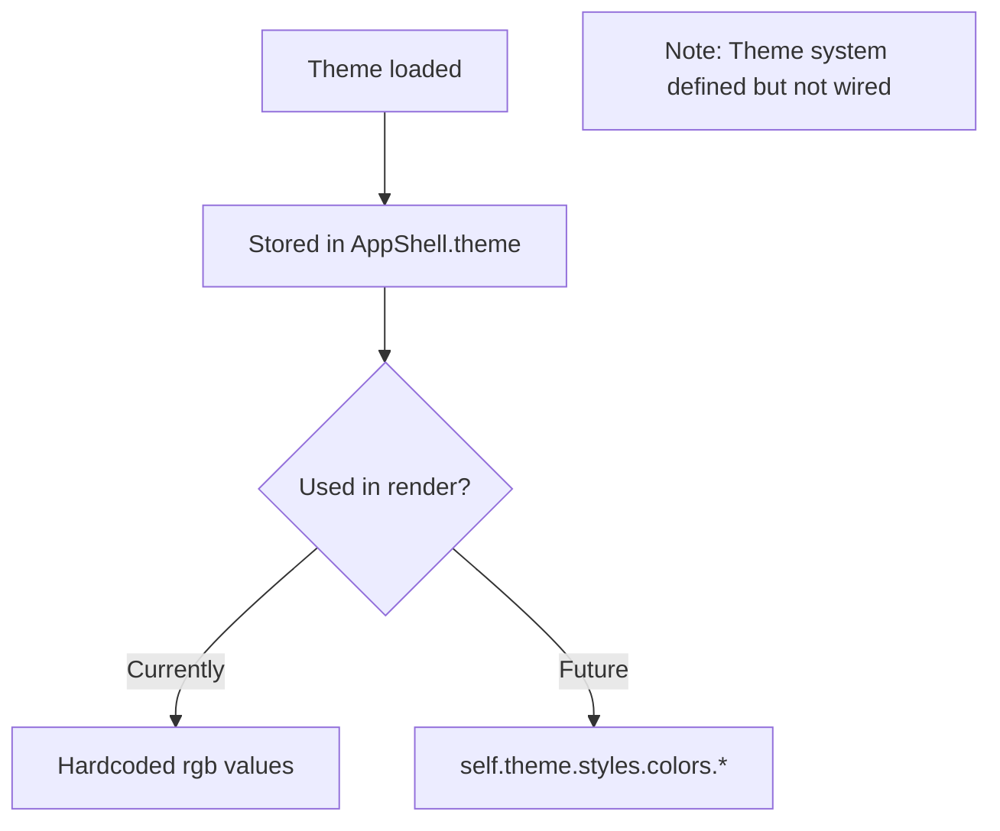

### Intended Usage

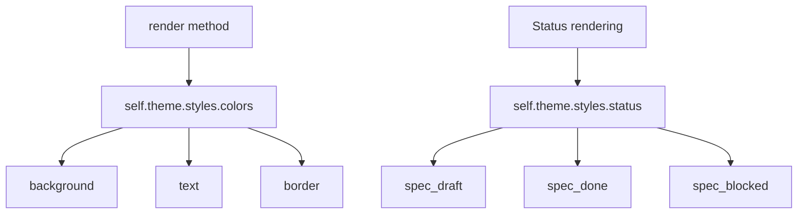

## Future Enhancements
{{status: done}}

### Planned Features

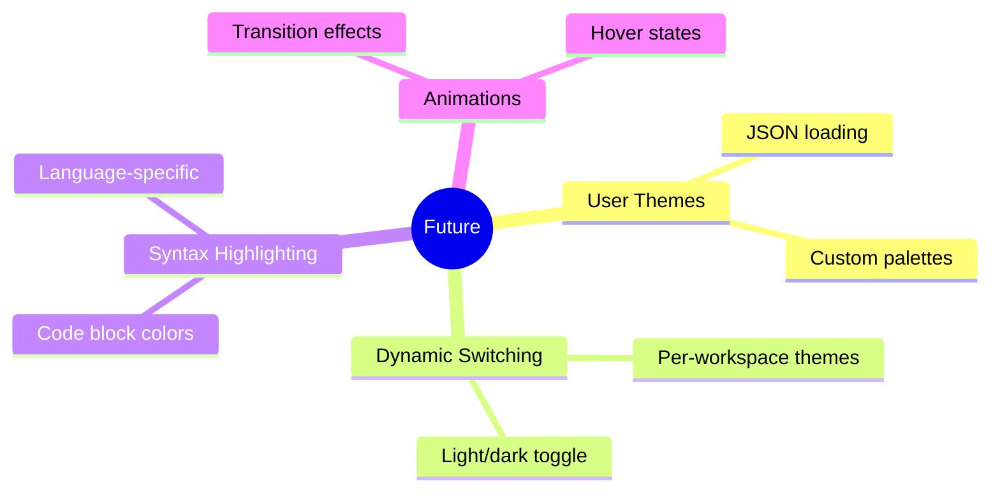

### User Theme Loading (Stub)

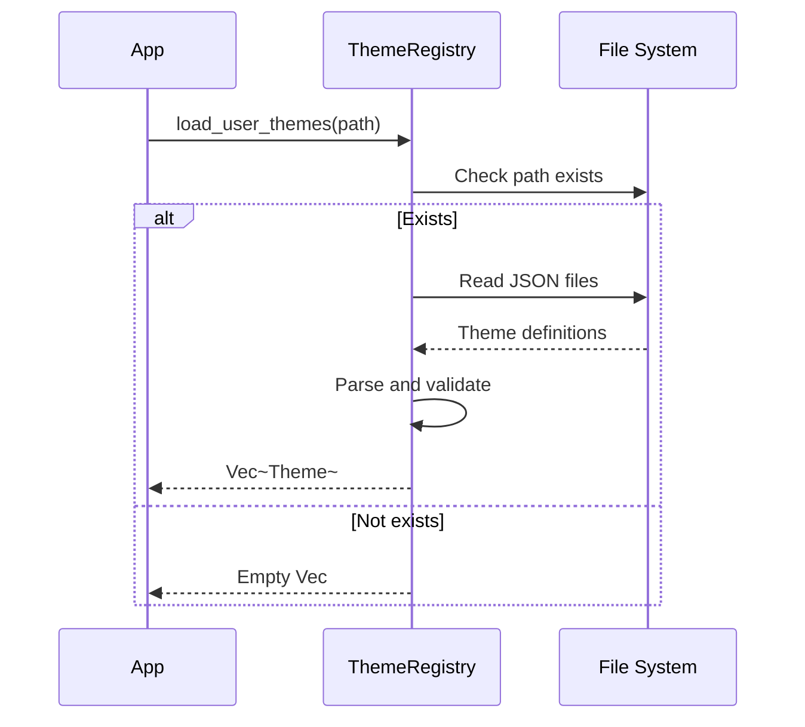
