# Architecture

```mermaid
graph TB
    subgraph Interface["Interface"]
        TUI["<b>TUI</b><br/>Textual full-screen app"]
    end

    Store["<b>Store</b><br/>SQLite · append-only event log<br/>Agent state · tool calls · tokens · questions · approvals<br/>All processes read/write the same DB"]

    TUI <--> Store

    subgraph "Agent Instance"
        direction TB
        Loop["<b>Loop</b><br/>think → tool → observe<br/>owns its own turn history<br/>can spawn sub-agent loops"]
        Context["<b>Context Manager</b><br/>Tracks what the agent sees:<br/>system prompt · conversation · tool results<br/>Budget · priority · compaction"]
        LLM["<b>LLM Provider</b><br/>Configured model<br/>Streaming · token counting"]
        ToolExec["<b>Tool Executor</b><br/>Tool set with policy<br/>(auto/confirm/deny)"]

        Loop --> Context
        Loop --> LLM
        Loop --> ToolExec
        Loop -->|spawns| Loop
        Context --> LLM
    end

    Loop <--> Store

    subgraph "Primary Tools"
        direction TB
        FileOps["<b>File Ops</b><br/>read · write · list · search"]
        Bash["<b>Bash</b><br/>execute commands<br/>sandboxed"]
        Git["<b>Git</b><br/>branch · commit · diff · PR"]
        Questions["<b>Questions</b><br/>Clarification · approval<br/>written to Store · TUI renders"]
        ReturnToParent["<b>Return to Parent</b><br/>Sub-agent completion<br/>requires context payload"]
        Memory["<b>Memory</b><br/>Cross-session knowledge<br/>Distilled context an agent carries forward"]
        SkillTools["<b>Skills</b><br/>Discover · load · invoke<br/>Inject into prompt + tool surface"]
        MCPTools["<b>MCP</b><br/>External servers<br/>Scoped resources + tools"]
    end

    ToolExec --> FileOps
    ToolExec --> Bash
    ToolExec --> Git
    ToolExec --> Questions
    ToolExec --> ReturnToParent
    ToolExec --> Memory
    ToolExec --> SkillTools
    ToolExec --> MCPTools

    Questions -.-> Store
    Git -.-> Store

    subgraph "Shared Services"
        Commands["<b>Commands</b><br/>Slash command registry<br/>/compact /cost /help /memory"]
        LSP["<b>LSP Manager</b><br/>Per-language servers<br/>go-to-def · references · hover"]
        Symbols["<b>Symbols</b><br/>Indexer · resolver<br/>Cross-ref DB"]
        Config["<b>Config</b><br/>Settings · policies<br/>Project overrides"]
        Auth["<b>Auth</b><br/>Per-provider credentials<br/>OAuth · PKCE · caching"]
    end

    Loop -.-> Commands

    FileOps -.-> LSP
    FileOps -.-> Symbols
    LLM -.-> Auth
    ToolExec -.-> Config
    Context -.-> Config

    style TUI fill:#4a9eff,color:#fff
    style Store fill:#38d9a9,color:#000
    style Loop fill:#ff6b6b,color:#fff
    style Context fill:#ffa94d,color:#fff
    style LLM fill:#ffa94d,color:#fff
    style ToolExec fill:#ffa94d,color:#fff
    style FileOps fill:#ffd43b,color:#000
    style Bash fill:#ffd43b,color:#000
    style Git fill:#ffd43b,color:#000
    style Questions fill:#ffd43b,color:#000
    style ReturnToParent fill:#ffd43b,color:#000
    style Memory fill:#ffd43b,color:#000
    style SkillTools fill:#ffd43b,color:#000
    style MCPTools fill:#ffd43b,color:#000
    style LSP fill:#69db7c,color:#000
    style Symbols fill:#69db7c,color:#000
    style Commands fill:#b197fc,color:#fff
    style Config fill:#b197fc,color:#fff
    style Auth fill:#b197fc,color:#fff
```



---

## Interface

Taui ships one interface in v0.2.0: a full-screen Textual TUI. It starts with no flags when you run `taui`.

The TUI is responsible for chat rendering, streaming deltas, tool status, approvals, questions, steering, queued follow-up messages, context views, and diff views. The Store remains the durable log behind the interface, but there is no separate CLI REPL or web server in the current product surface.

---

## Store

SQLite append-only event log. Every event in the system — agent state changes, tool calls, token streams, messages, questions, approvals — gets appended as a row. The TUI, agents, and services all read and write the same database.

The TUI tails the log to stay current. A tool like Questions writes a question row and blocks; the TUI reads it, collects the user's answer, and writes the response row back.

This replaces the need for a separate event bus, message queue, or stream infrastructure. SQLite handles the durability, and offset-based reads handle the replay. Session history, event streaming, and inter-process communication are all the same thing: rows in a table.

Current baseline: one Python process hosts both the TUI and agent runtime. This keeps stream delivery simple because `StreamClient.tail()` can rely on in-process wakeups.

Each component (Store, Loop, Context Manager, Tool Executor, etc.) is designed as a module with explicit interfaces. The single-process runtime is the current deployment model, not an architectural constraint. Components communicate through the Store and defined Python interfaces, not shared mutable state, so they can be separated into distinct processes later without redesigning the boundaries.

### Streams

Each agent run gets its own stream — an ordered sequence of event chunks in the Store, addressed by offset. The stream is just rows in a SQLite table keyed by `(stream_id, offset)`. No external stream server, no HTTP protocol, no sidecar process. Everything runs inside the same Python process.

**Writing.** The agent loop appends events to its stream via a direct Python method call (`StreamClient.append_auto()`). Each append inserts a row and wakes any in-process waiters. SQLite WAL mode ensures readers are never blocked by a write.

**Reading (live).** The TUI calls `StreamClient.tail()` — an async generator that reads existing chunks, then blocks on an `asyncio.Event` until the next append arrives.

**Reading (reconnect).** Session replay uses `StreamClient.read(from_offset=last_seen)` to catch up on missed events in one batch, then switches to `tail()` for live updates. Nothing is lost between restarts because the stream rows are durable in SQLite.


**Per-agent isolation.** Each agent writes to its own stream (`agents/{agent_id}`). Streams never share offsets, so parallel writes to different streams don't contend. Sub-agents get their own streams linked by `parent_agent_id`. The Store remains a single SQLite file — one database, many logical streams.

```
Agent Loop                          Frontend
    │                                    │
    │  StreamClient.append_auto()        │
    ▼                                    │
┌──────────┐                             │
│  Store    │  ◄── StreamClient.tail() ──┤
│ (SQLite)  │      StreamClient.read()   │
│ WAL mode  │                            ▼
└──────────┘                      TUI
```

---

## Agent Instance

### Loop
The core think→tool→observe cycle. Runs with its own turn counter and turn history. The loop calls the LLM, receives tool-call requests, dispatches them through the Tool Executor, observes results, and repeats until the agent produces a final response or hits a stop condition.

A loop can spawn sub-agent loops for focused sub-tasks. Each sub-agent gets its own Loop, Context Manager, LLM Provider, and Tool Executor. The parent configures the child — which model, which tools, what context budget, and what completion contract to enforce. Sub-agents are sequential: the parent waits for one to finish before continuing.

Sub-agent completion is explicit: a child completes by calling the sub-agent-only return-to-parent tool. That tool requires a context payload, and the payload is the canonical completion artifact returned to the parent.

The child stream still remains in the Store for full traceability. Parent/coordinator logic can use stream events for cost rollup and diagnostics while using the return-to-parent payload as the handoff result. If a child exits before return-to-parent (for example due to error or cancellation), the parent receives a failure outcome instead of a completion payload.

### Context Manager
Tracks everything the agent can see: system prompt, conversation history, tool results, injected skill context, and memory. Manages the token budget — decides what to keep, what to compact, and what to drop when the window fills up.

Every chunk of context carries an internal tag visible only to the Context Manager. Tags classify what a chunk is — for example: system_prompt, skill_definitions, tool_definitions, user_message, llm_message, llm_tool_call, tool_call_return, skill_content, and others. The Context Manager uses these tags to make compaction decisions: which chunks to summarize, which to drop, and which to preserve based on their role rather than just their age or size.

Skills are budgeted before injection. For each skill, token usage is estimated as chat_count / 4 = n_tokens. Before loading a skill, the Context Manager checks projected usage (current context plus estimated skill tokens).

If projected usage exceeds 80 percent of the model context window, compaction is triggered before skill injection. 80 percent is the target operating zone; above that point model quality is expected to degrade.

### LLM Provider
The configured model for this agent instance. Handles streaming responses and token counting. The Context Manager feeds it the assembled prompt; it returns completions and tool-call requests.

### Tool Executor
The policy gate that sits between the Loop and the Primary Tools. The agent has a scoped tool set — not every tool is necessarily available. The executor evaluates policies before dispatching to the actual tool implementation.

Each tool action has a policy: **auto** (execute without asking), **confirm** (ask user before executing), or **deny** (block entirely). Policies are resolved in order of specificity:

1. **Per-agent** — the parent can restrict a sub-agent's tool set when spawning it.
2. **Per-project** — project-level config can override defaults for this workspace.
3. **Global** — user-wide defaults.

The most specific policy wins. If no override exists, the tool's built-in default applies.

#### Default Tool Policies

| Tool       | Default | Scope notes |
|------------|---------|-------------|
| File Read  | auto    | Auto for the project directory Taui launched from. Other paths default to confirm. User can widen to auto for entire system. |
| File Write | confirm | Auto within project dir is a common user override. |
| Bash       | confirm | Can be set to auto for read-only commands, deny for untrusted agents. |
| Git        | confirm | Commits and pushes require confirmation by default. |
| Questions  | auto    | Agent can always ask clarifying questions. |
| Return to Parent | auto | Sub-agent completion is always permitted. |
| Memory     | auto    | Reading and writing agent memory. |
| Skills     | auto    | Discovering and loading skills. |
| MCP        | confirm | External server calls require confirmation. |

Users can change any of these at any scope level. For example, setting File Read to auto globally lets the agent read any file on the system without prompting.

---

## Primary Tools

The concrete tool implementations that the Tool Executor dispatches to.

### File Ops
Read, write, list, and search files in the workspace. The most heavily-used tool surface. Can integrate with LSP and Symbols for smarter file discovery and navigation.

### Bash
Execute shell commands in a sandboxed environment. Policy-controlled: the agent may have unrestricted bash, be limited to read-only commands, or be denied entirely.

### Git
Branch, commit, diff, and open PRs. Events are written to the Store so the TUI can render them appropriately.

### Questions
Clarification and approval requests from agent to user. The tool writes a question event to the Store and blocks until the TUI writes the user's answer back.

### Return to Parent
Sub-agent-only completion tool. Calling it ends the child run and returns required context to the parent agent.

### Memory
Cross-session knowledge that an agent carries forward. Unlike History (which stores raw conversation logs), Memory stores distilled insights — patterns learned, mistakes to avoid, user preferences, project conventions. Agents can read and write memory as a tool call.

### Skills
Discover, load, and invoke skill packages. Skills are reusable capability bundles (a SKILL.md with instructions, optional schema, optional examples) that get injected into the agent's prompt and can also surface as additional tools. Loading a skill mid-conversation expands what the agent can do.

Injected skill context is not pinned by default. It participates in normal Context Manager compaction when projected prompt usage crosses the 80 percent threshold.

### MCP
Connect to external Model Context Protocol servers that expose tools and resources. The agent can be configured with a scoped set of MCP servers it's allowed to reach.

---

## Shared Services

### Commands
Slash command registry (/compact, /cost, /help, /memory, etc.). Commands are user-facing actions injected into the agent's input stream — they trigger context compaction, cost display, mode switches, and other operations.

### LSP Manager
Manages one LSP server instance per language across the workspace. Provides go-to-definition, find-references, hover, and completion.

### Symbols
Workspace-wide code symbol index. Crawls and indexes functions, classes, variables, and their relationships into a searchable database. Enables cross-reference queries ("what calls this function?") that augment File Ops and Context Manager.

### Config
Global and project-level settings: model preferences, tool policies, bash policies, UI preferences, project overrides.

### Auth
Per-provider credential management. Handles OAuth flows, PKCE, API key storage, and token caching for LLM providers.

---

## Core vs Shared

| Component        | Scope    | Role                                              |
|------------------|----------|---------------------------------------------------|
| **TUI**          | global   | Textual terminal UI — rich interactive interface   |
| **Store**        | global   | SQLite append-only log — events, history, IPC      |
| **Loop**         | agent    | think→tool→observe cycle — owns turn history, spawns sub-agents |
| **Context Manager**| agent  | What the agent sees — budget, priority, compaction |
| **LLM Provider** | agent    | Configured model — streaming, token counting       |
| **Tool Executor**| agent    | Policy gate — routes to primary tools              |
| **Commands**     | service  | Slash command registry                             |
| **File Ops**     | tool     | read · write · list · search files                 |
| **Bash**         | tool     | Execute shell commands — sandboxed                 |
| **Git**          | tool     | branch · commit · diff · PR                        |
| **Questions**    | tool     | Clarification · approval — via Store               |
| **Return to Parent** | tool | Sub-agent-only completion handoff with required context |
| **Memory**       | tool     | Cross-session knowledge — distilled, persistent    |
| **Skills**       | tool     | Discover · load · invoke skill packages            |
| **MCP**          | tool     | External servers — scoped resources + tools        |
| **LSP Manager**  | service  | Language servers — code nav per language            |
| **Symbols**      | service  | Code index — symbol search and cross-refs          |
| **Config**       | service  | Settings + policies                                |
| **Auth**         | service  | Credentials — per-provider auth flows              |

---

## Per-Agent vs Shared

Each agent instance gets its own:
- **Loop** — its own think→tool→observe cycle, turn counter, and ability to spawn sub-agents
- **Context Manager** — its own context window, token budget, compaction decisions. Every context chunk is internally tagged (e.g. system_prompt, skill_content, tool_call_return) so compaction can reason about chunk role, not just size or age
- **LLM Provider** — its own configured model (agents can use different providers)
- **Tool Executor** — scoped tool set with per-agent policies

Shared across all agents:
- **Commands** — slash command registry
- **LSP Manager** — one LSP server per language, shared
- **Symbols** — single workspace-wide index
- **Config** — global + project settings (agents read scoped views)
- **Auth** — credential cache (shared across providers)
- **Store** — SQLite append-only event log — events, history, and inter-process communication in one place

When the parent agent spawns a sub-agent, it configures the child's per-agent components: which model, which tools, what context budget, and the completion contract. The parent waits for the sub-agent to complete before continuing.

---

## Future Extensions

See [future.md](future.md) for ideas the architecture can support but that are not current requirements.
